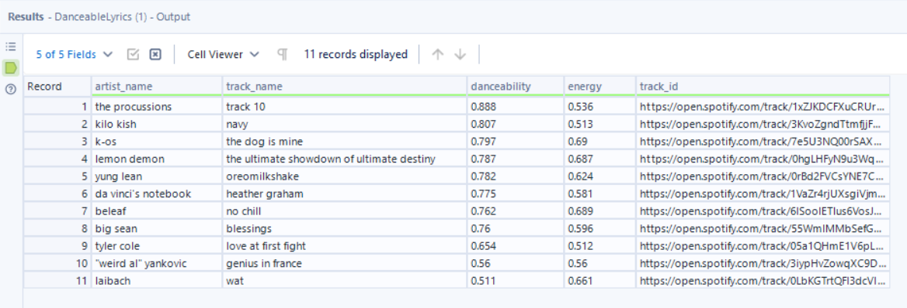

# Danceable Lyrics
In this guide, we use the [Alteryx Python SDK](https://pypi.org/project/ayx-python-sdk/) and [Alteryx Plugin CLI](https://pypi.org/project/ayx-plugin-cli/) to create a tool that connects directly to a set of data files and determines the most "danceable" songs that contain a set of lyrics. Perhaps we started this journey with this problem statement:
> I'm a Spotify Product Analyst who wants to perform a proof of concept (POC) on whether it's possible to determine the most "danceable" songs that contain a set of lyrics. If possible, this POC can help drive the development of a new Recommendation feature on the Spotify app.

We use [Polars](https://www.pola.rs/) for data processing. Polars has many benefits over the more common Pandas. Some key benefits include:
* It's extremely **fast**.
* Polars can optimize queries and perform parallel processing for free.
* It has a very familiar API to expressively manipulate `DataFrame`s.
* Zero-copy support with [Apache Arrow](https://arrow.apache.org/), our native SDK format.

> :information_source: For more information on Polars, go to the [Polars User Guide](https://pola-rs.github.io/polars-book/user-guide/) and the [Python API](https://pola-rs.github.io/polars/py-polars/html/reference/).

## Table of Contents
* [Download Input Data](#download-input-data)
* [Basic Plugin Setup](#basic-plugin-setup)
* [Write a Plugin](#write-a-plugin)
    * [Dependencies](#1-dependencies)
    * [Imports](#2-imports)
    * [Initialization](#3-initialization)
    * [Data Processing](#4-data-processing)
    * [Putting It All Together](#5-putting-it-all-together)
* [Packaging into a YXI](#package-into-a-yxi)
* [Run the Test Client](#run-the-test-client)
* [Install in Designer](#install-and-run-in-designer)
    * [Method 1](#method-1)
    * [Method 2](#method-2)
* [Run in Designer](#run-in-designer)

## Download Input Data
Download and extract the required dataset files. You will reference them later in this guide. We provide 2 datasets—the full dataset and a smaller, truncated version.

* The full version expands to around 11 GB of data. You can [download it here](https://drop.alteryx.com/public/file/SAlShV5VqkOI5_Jyx1me3w/Danceable_Lyrics_demo_data-Inspire-2023.7z).
* The truncated version expands to around 5.7 GB of data. You can [download it here](https://drop.alteryx.com/public/file/yHv77vLzKkCXHj8-OWVg0Q/Danceable_Lyrics_demo_data-Inspire-(Truncated)-2023.7z).

Go to the `README.md` files within the respective archives for source information.

Before we proceed, let's take a quick look at the data set files:


Above, we see `genius_song_lyrics.csv` is made up of the columns `title`, `tag`, `artist`, `year`, `views`, `features`, `lyrics`, `id`, `language_cld3`, `language_ft`, and `language`. Notice that `lyrics` contains strings with multiple lines. Let's look at this just a bit closer:


We can see the strings are quoted. This is great, Polars supports all of this right out of the box!

Let's move on to our input files which contain track features:


Above, we pipe commands through `tail --bytes +4` in order to skip past the first 4 bytes, which represent a UTF-8 [Byte Order Mark (BOM)](https://en.wikipedia.org/wiki/Byte_order_mark) in our input CSV files. But this is something Polars can handle for us. Let's try another approach using Python and Polars:

```text
>>> import polars as pl
>>> print(pl.scan_csv("audio_features.csv").collect().head(5))
shape: (5, 15)
┌────────────────────────┬──────────────┬───────────────────────────────────┬──────────────┬───┬─────────────┬─────────┬────────────────┬─────────┐
│ id                     ┆ acousticness ┆ analysis_url                      ┆ danceability ┆ … ┆ speechiness ┆ tempo   ┆ time_signature ┆ valence │
│ ---                    ┆ ---          ┆ ---                               ┆ ---          ┆   ┆ ---         ┆ ---     ┆ ---            ┆ ---     │
│ str                    ┆ f64          ┆ str                               ┆ f64          ┆   ┆ f64         ┆ f64     ┆ i64            ┆ f64     │
╞════════════════════════╪══════════════╪═══════════════════════════════════╪══════════════╪═══╪═════════════╪═════════╪════════════════╪═════════╡
│ 2jKoVlU7VAmExKJ1Jh3w9P ┆ 0.18         ┆ https://api.spotify.com/v1/audio… ┆ 0.893        ┆ … ┆ 0.283       ┆ 95.848  ┆ 4              ┆ 0.787   │
│ 4JYUDRtPZuVNi7FAnbHyux ┆ 0.272        ┆ https://api.spotify.com/v1/audio… ┆ 0.52         ┆ … ┆ 0.427       ┆ 177.371 ┆ 4              ┆ 0.799   │
│ 6YjKAkDYmlasMqYw73iB0w ┆ 0.0783       ┆ https://api.spotify.com/v1/audio… ┆ 0.918        ┆ … ┆ 0.133       ┆ 95.517  ┆ 4              ┆ 0.779   │
│ 2YlvHjDb4Tyxl4A1IcDhAe ┆ 0.584        ┆ https://api.spotify.com/v1/audio… ┆ 0.877        ┆ … ┆ 0.259       ┆ 94.835  ┆ 4              ┆ 0.839   │
│ 3UOuBNEin5peSRqdzvlnWM ┆ 0.17         ┆ https://api.spotify.com/v1/audio… ┆ 0.814        ┆ … ┆ 0.233       ┆ 93.445  ┆ 4              ┆ 0.536   │
└────────────────────────┴──────────────┴───────────────────────────────────┴──────────────┴───┴─────────────┴─────────┴────────────────┴─────────┘
>>> print(pl.scan_csv("r_track_artist.csv").collect().head(5))
shape: (5, 2)
┌────────────────────────┬────────────────────────┐
│ track_id               ┆ artist_id              │
│ ---                    ┆ ---                    │
│ str                    ┆ str                    │
╞════════════════════════╪════════════════════════╡
│ 2jKoVlU7VAmExKJ1Jh3w9P ┆ 4tujQJicOnuZRLiBFdp3Ou │
│ 2jKoVlU7VAmExKJ1Jh3w9P ┆ 2VX0o9LDIVmKIgpnwdJpOJ │
│ 2jKoVlU7VAmExKJ1Jh3w9P ┆ 3iBOsmwGzRKyR0vs2I61xP │
│ 2jKoVlU7VAmExKJ1Jh3w9P ┆ 22qf8cJRzBjIWb2Jc4JeOr │
│ 4JYUDRtPZuVNi7FAnbHyux ┆ 4akj4uteQQrrGxhX9Rjuyf │
└────────────────────────┴────────────────────────┘
>>> print(pl.scan_csv("tracks.csv").collect().head(5))
shape: (5, 10)
┌────────────────────────┬─────────────┬──────────┬──────────┬───┬───────────────────────────────────┬──────────────┬────────────┬─────────────┐
│ id                     ┆ disc_number ┆ duration ┆ explicit ┆ … ┆ preview_url                       ┆ track_number ┆ popularity ┆ is_playable │
│ ---                    ┆ ---         ┆ ---      ┆ ---      ┆   ┆ ---                               ┆ ---          ┆ ---        ┆ ---         │
│ str                    ┆ i64         ┆ i64      ┆ i64      ┆   ┆ str                               ┆ i64          ┆ i64        ┆ i64         │
╞════════════════════════╪═════════════╪══════════╪══════════╪═══╪═══════════════════════════════════╪══════════════╪════════════╪═════════════╡
│ 1dizvxctg9dHEyaYTFufVi ┆ 1           ┆ 275893   ┆ 1        ┆ … ┆                                   ┆ 12           ┆ 0          ┆ null        │
│ 2g8HN35AnVGIk7B8yMucww ┆ 1           ┆ 252746   ┆ 1        ┆ … ┆ https://p.scdn.co/mp3-preview/77… ┆ 13           ┆ 77         ┆ null        │
│ 49pnyECzcMGCKAqxfTB4JZ ┆ 3           ┆ 315080   ┆ 0        ┆ … ┆                                   ┆ 6            ┆ 8          ┆ 1           │
│ 4E5IFAXCob6QqZaJMTw5YN ┆ 1           ┆ 240800   ┆ 1        ┆ … ┆ https://p.scdn.co/mp3-preview/f3… ┆ 2            ┆ 70         ┆ null        │
│ 1gSt2UlC7mtRtJIc5zqKWn ┆ 2           ┆ 203666   ┆ 0        ┆ … ┆                                   ┆ 2            ┆ 50         ┆ null        │
└────────────────────────┴─────────────┴──────────┴──────────┴───┴───────────────────────────────────┴──────────────┴────────────┴─────────────┘
```

## Basic Plugin Setup
Before you proceed, please ensure you have this basic setup:

1. [Create a Workspace](../create-a-workspace.md) to house your plugin.
2. [Add a new plugin](../create-a-plugin.md).
    1. When prompted choose **Input** as the type.
    2. To match what is found in this guide, choose **DanceableLyrics** as the plugin name.

After you run the above setup procedures, you will have a file named `danceable_lyrics.py` under `./backend/ayx_plugins` with a generated boilerplate. When you open the file, you should see something like this:

```python
class DanceableLyrics(PluginV2):
    """Concrete implementation of an AyxPlugin."""

    @staticmethod
    def _validate_datasets_dir(datasets_dir: Path) -> None:
        # truncated code

    def __init__(self, provider: AMPProviderV2) -> None:
        self.provider = provider
        # truncated code

    def on_incoming_connection_complete(self, anchor: namedtuple) -> None:
        raise NotImplementedError("Input tools don't receive batches.")

    def on_record_batch(self, batch: "pa.Table", anchor: namedtuple) -> None:
        raise NotImplementedError("Input tools don't receive batches.")

    def on_complete(self) -> None:
        # truncated code
```

## Write a Plugin
In this guide, we use multiple data files. We read each directly to illustrate a connector-like plugin. That is, to connect directly to local or remote data sources. While here, we read CSV input files, these could be in any format, including formats that Alteryx Designer does not directly support.

> :information_source: To see an Input tool that connects to a remote API, check out [Creating an API Tool](https://github.com/alteryx/ayx-developer-sdk/blob/main/docs/howto/how-to-make-api-tool/api-tool-guide.md)!

> :information_source: Since this is an Input tool, we only focus on the `__init__` and `on_complete` functions. For additional information on the lifecycle of a plugin, refer to the [AYX Python SDK documentation](https://alteryx.github.io/ayx-python-sdk/plugin_lifecycle.html).

### 1. Dependencies
The first step is to update our `./backend/requirements-thirdparty.txt` file and tell Python we depend on Polars as a 3rd-party dependency. To do this, add a single line to the file:

```txt
polars==0.17.9
```

### 2. Imports
The next step is to update our Python module's imports. Imports tell Python what other code we will reference in our plugin. Add the required import statements near the top of your `danceable_lyrics.py` file. Your code should look like this:

```python
from collections import namedtuple

from pathlib import Path

from ayx_python_sdk.core import PluginV2
from ayx_python_sdk.core.exceptions import WorkflowRuntimeError
from ayx_python_sdk.core.field import FieldType
from ayx_python_sdk.core.utils import create_schema
from ayx_python_sdk.providers.amp_provider.amp_provider_v2 import AMPProviderV2

import polars as pl
import pyarrow as pa
```

### 3. Initialization
Now, let's update the plugin's `__init__` method and set up some basic variables that we will reference later in the code. To start, modify the start of `__init__` to set a base path to _where you extracted your data assets_. Use `self.DATASETS_BASE` to do so. The result should look something like this:

```python
    def __init__(self, provider: AMPProviderV2) -> None:
        """Construct a plugin."""
        self.provider = provider
        self.name = "DanceableLyrics"

        # Point this variable to your extracted datasets directory:
        self.DATASETS_BASE = Path("c:/users/alteryx/DanceableLyricsData/")
```
It's probably a good idea to validate this path and ensure 1) that it exists, 2) that it is a directory, and 3) that it contains all the files we need. We can do that like so:

```python
    @staticmethod
    def _validate_datasets_dir(datasets_dir: Path) -> None:
        if not datasets_dir.is_dir():
            raise WorkflowRuntimeError("Bad path")

        filenames = [
            "artists.csv",
            "tracks.csv",
            "r_track_artist.csv",
            "genius_song_lyrics.csv",
            "audio_features.csv",
        ]
        nonexistent_files = ", ".join(
            filter(lambda filepath: not (datasets_dir / filepath).is_file(), filenames)
        )

        if nonexistent_files:
            raise WorkflowRuntimeError(f"Expected files not found: {nonexistent_files}")
```

and then call this method like so:

```python
    # Point this variable to your extracted datasets directory:
    self.DATASETS_BASE = Path("c:/users/alteryx/DanceableLyricsData/")

    self._validate_datasets_dir(self.DATASETS_BASE)
```

Next, let's tell downstream tools what our plugin's metadata looks like. That is, what fields and their data types the plugin will output:

```python
    self.provider.push_outgoing_metadata(
        "Output",
        create_schema(
            {
                "artist_name": {"type": FieldType.v_wstring},
                "track_name": {"type": FieldType.v_wstring},
                "danceability": {"type": FieldType.float},
                "energy": {"type": FieldType.float},
                "track_id": {"type": FieldType.v_wstring},
            }
        ),
    )
```

Now Designer and downstream tools will know exactly what kind of data to expect from our plugin.

Since we want to find the "most danceable" songs based on particular lyrics, let's provide some terms or phrases. Our tool will then gather songs (or "tracks") that contain lyrics with these terms.

```python
    self.LYRICS_TERMS = [
        "star wars",
        "star trek",
        "luke skywalker",
        "captain kirk",
        "spock",
        "yoda",
    ]
```

> :warning: Be aware that these datasets are *not* filtered in any way, and songs or titles might contain explicit content!

Finally, let's add some additional criteria for our analysis and an output message to display when the plugin is initialized. Feel free to play around with these values!

```python
    self.DANCEABILITY_RANGE = [0.45, 0.99]
    self.ENERGY_RANGE = [0.45, 0.75]
    self.TEMPO_RANGE = [110.0, 140.0]
    self.MIN_VIEWS = 1000

    self.provider.io.info(f"{self.name} initialized.")
```

When you have completed the above steps, your `__init__` should look something like this:

```python
def __init__(self, provider: AMPProviderV2) -> None:
    """Construct a plugin."""
    self.provider = provider
    self.name = "DanceableLyrics"

    # Point this variable to your extracted datasets directory:
    self.DATASETS_BASE = Path("c:/users/alteryx/DanceableLyricsData/")

    self._validate_datasets_dir(self.DATASETS_BASE)

    self.provider.push_outgoing_metadata(
        "Output",
        create_schema(
            {
                "artist_name": {"type": FieldType.v_wstring},
                "track_name": {"type": FieldType.v_wstring},
                "danceability": {"type": FieldType.float},
                "energy": {"type": FieldType.float},
                "track_id": {"type": FieldType.v_wstring},
            }
        ),
    )

    self.LYRICS_TERMS = [
        "star wars",
        "star trek",
        "luke skywalker",
        "captain kirk",
        "spock",
        "yoda",
    ]
    self.DANCEABILITY_RANGE = [0.45, 0.99]
    self.ENERGY_RANGE = [0.45, 0.75]
    self.TEMPO_RANGE = [110.0, 140.0]
    self.MIN_VIEWS = 1000

    self.provider.io.info(f"{self.name} initialized.")
```

> :information_source: To make your Input plugin more dynamic, you can use the [Alteryx UI-SDK](https://github.com/alteryx/dev-harness) and have a user supply many of the variables above.

### 4. Data Processing
Now it's time to process some data! Since we don't currently attempt incoming data, but rather, _provide_ data as output, we'll do the bulk of our work in `on_complete`.

Our first data input is from the `genius_song_lyrics.csv` file, where we will discover songs with lyrics that contain our search terms:

```python
def on_complete(self) -> None:

    self.provider.io.info(f"{self.name} building sample lyrics query...")

    sample = (
        pl.scan_csv(self.DATASETS_BASE / "genius_song_lyrics.csv")
        .select(
            pl.col("title").str.to_lowercase().alias("track_name"),
            pl.col("artist").str.to_lowercase().alias("artist_name"),
            "lyrics",
            "language",
            "views",
        )
        .filter(
            (pl.col("views") > self.MIN_VIEWS)
            & (pl.col("language") == "en")
            & (
                pl.col("lyrics").str.contains(
                    "(?i)" + "|(?i)".join(self.LYRICS_TERMS)
                )
            )
        )
        .select("track_name", "artist_name")
    )
```

Above, we tell Polars to create a [LazyFrame](https://pola-rs.github.io/polars/py-polars/html/reference/lazyframe/index.html) that contains select columns from rows that match our criteria. We also normalize some column names—we lowercase them and add aliases in the output. In the `filter` clause, we build a case-insensitive [regular expression](https://en.wikipedia.org/wiki/Regular_expression) from the list of terms. We then filter out non-English terms and restrict results to only entries with more than `self.MIN_VIEWS`. Finally, we only use `track_name` and `artist_name` in the query. You might want to alter these criteria a bit. For example, you might want to allow other languages.

The next section of code reads from multiple input files and joins them into a single `danceable_tracks` view of the data that contains columns that match our criteria.

```python
    self.provider.io.info(
        f"{self.name} building danceable track information query..."
    )

    artists = pl.scan_csv(self.DATASETS_BASE / "artists.csv").select(
        pl.col("name").str.to_lowercase().alias("artist_name"),
        pl.col("id").alias("artist_id"),
    )

    tracks = (
        pl.scan_csv(self.DATASETS_BASE / "tracks.csv")
        .select(
            pl.col("name").str.to_lowercase().alias("track_name"),
            pl.col("id").alias("track_id"),
            "explicit",
        )
        .filter(pl.col("explicit") == 0)
    )

    audio_features = (
        pl.scan_csv(self.DATASETS_BASE / "audio_features.csv")
        .select(pl.col("id").alias("track_id"), "danceability", "energy", "tempo",)
        .filter(
            (pl.col("danceability").is_between(*self.DANCEABILITY_RANGE))
            & (pl.col("energy").is_between(*self.ENERGY_RANGE))
            & (pl.col("tempo").is_between(*self.TEMPO_RANGE))
        )
    )

    track_artists = (
        pl.scan_csv(self.DATASETS_BASE / "r_track_artist.csv")
        .select("track_id", "artist_id")
        .join(artists, on="artist_id")
        .join(tracks, on="track_id")
        .join(audio_features, on="track_id")
    )

    danceability_tracks = (
        track_artists.select(
            "artist_name",
            "track_name",
            "danceability",
            "energy",
            ("https://open.spotify.com/track/" + pl.col("track_id")),
        )
        .groupby(["artist_name", "track_name"])
        .agg([pl.all().sort_by("danceability", descending=True).first()])
    )
```

The above code joins `track_artists` against `artists`, `tracks`, and `audio_features`. `danceability_tracks` is then created by selecting the desired columns from `track_artists`. We also prefix the `track_id` with a base URL to build a full Spotify open link.

We then group by `artist_name` and `track_name`. Each group is sorted by `danceability`, and the row with the highest `danceability` is taken.

If we output `danceability_tracks` via `print(danceability_tracks.collect())`, we'll see a header similar to this:

```txt
artist_name | track_name | danceability | energy | literal
```
As you can see, this combines data from multiple sources.

Now that we have both a sample of songs with lyrics that contain our terms and track information that includes "danceability", let's find our matches! Add this code:

```python
    self.provider.io.info(f"{self.name} calculating final results...")

    matches = (
        danceability_tracks.join(sample, on=["artist_name", "track_name"])
        .sort("danceability", descending=True)
        .collect()
    )
```

The above code joins `danceability_tracks` with the entries in `sample`. The results are then sorted by `danceability`.

Now that we have our `matches`, let's output them to Designer!

```python
    self.provider.write_to_anchor(
        "Output", pa.Table.from_pandas(matches.to_pandas())
    )

    self.provider.io.info(f"{self.name} finished.")
```

> :information_source: You might notice something a bit odd here. We are constructing a PyArrow table (`pa.Table`) from a Pandas frame converted from Polars. This is because the current version of Polars `to_arrow()` produces unexpected results. Perhaps newer versions won't require this workaround.

### 5. Putting It All Together
> :information_source: See [danceable_lyrics.py](../danceable-lyrics-input-tool/DanceableLyrics/backend/ayx_plugins/danceable_lyrics.py) for the full source.

Let's take a look at our final `on_complete`. It should look like something like this:

```python
def on_complete(self) -> None:

    self.provider.io.info(f"{self.name} building sample lyrics query...")

    sample = (
        pl.scan_csv(self.DATASETS_BASE / "genius_song_lyrics.csv")
        .select(
            pl.col("title").str.to_lowercase().alias("track_name"),
            pl.col("artist").str.to_lowercase().alias("artist_name"),
            "lyrics",
            "language",
            "views",
        )
        .filter(
            (pl.col("views") > self.MIN_VIEWS)
            & (pl.col("language") == "en")
            & (
                pl.col("lyrics").str.contains(
                    "(?i)" + "|(?i)".join(self.LYRICS_TERMS)
                )
            )
        )
        .select("track_name", "artist_name")
    )

    self.provider.io.info(
        f"{self.name} building danceable track information query..."
    )

    artists = pl.scan_csv(self.DATASETS_BASE / "artists.csv").select(
        pl.col("name").str.to_lowercase().alias("artist_name"),
        pl.col("id").alias("artist_id"),
    )

    tracks = (
        pl.scan_csv(self.DATASETS_BASE / "tracks.csv")
        .select(
            pl.col("name").str.to_lowercase().alias("track_name"),
            pl.col("id").alias("track_id"),
            "explicit",
        )
        .filter(pl.col("explicit") == 0)
    )

    audio_features = (
        pl.scan_csv(self.DATASETS_BASE / "audio_features.csv")
        .select(pl.col("id").alias("track_id"), "danceability", "energy", "tempo",)
        .filter(
            (pl.col("danceability").is_between(*self.DANCEABILITY_RANGE))
            & (pl.col("energy").is_between(*self.ENERGY_RANGE))
            & (pl.col("tempo").is_between(*self.TEMPO_RANGE))
        )
    )

    track_artists = (
        pl.scan_csv(self.DATASETS_BASE / "r_track_artist.csv")
        .select("track_id", "artist_id")
        .join(artists, on="artist_id")
        .join(tracks, on="track_id")
        .join(audio_features, on="track_id")
    )

    danceability_tracks = (
        track_artists.select(
            "artist_name",
            "track_name",
            "danceability",
            "energy",
            ("https://open.spotify.com/track/" + pl.col("track_id")),
        )
        .groupby(["artist_name", "track_name"])
        .agg([pl.all().sort_by("danceability", descending=True).first()])
    )

    self.provider.io.info(f"{self.name} calculating final results...")

    matches = (
        danceability_tracks.join(sample, on=["artist_name", "track_name"])
        .sort("danceability", descending=True)
        .collect()
    )

    self.provider.write_to_anchor(
        "Output", pa.Table.from_pandas(matches.to_pandas())
    )

    self.provider.io.info(f"{self.name} finished.")
```

## Package into a YXI
Now that we have our code, it's time to package it all up into a portable YXI archive. To do this, we use the `ayx_plugin_cli create-yxi` command. The process looks like this:

```bash
~/MyWorkspace$ ayx_plugin_cli create-yxi
[Creating YXI] started
[Creating YXI] -- generate_config_files:generate_config_xml
[Creating YXI] -- generate_config_files:generate_tool_config_xml
[Creating YXI] .  generate_config_files:generate_manifest_jsons
[Creating YXI] Generating manifest.json for DanceableLyrics...
[Creating YXI] Done!
...omitted...
~\MyWorkspace\main.pyz -e ayx_python_sdk.providers.amp_provider.__main__:main
[Creating YXI] Created shiv artifact at: ~\MyWorkspace\main.pyz
[Creating YXI] .  create_yxi:create_yxi
[Creating YXI] finished
```

## Run the Test Client
Before you run your plugin in Designer, it's good practice to do some basic testing with `ayx-sdk-cli`'s `plugin run` command to check for any errors. Download and install the test client from [here](https://github.com/alteryx/ayx-developer-sdk/releases/tag/v2022.12.0) and run this from your workspace:

```bash
ayx-sdk-cli plugin run DanceableLyrics -o danceable.csv --log-file log.txt --log-facility file -y
```
**NOTE: The test client, ayx-sdk-cli, is NOT the same as ayx-plugin-cli.**

The above command runs our plugin and produces two files - a logfile `out.log` and an output dataset `danceable.csv`. You can run `ayx-sdk-cli plugin run --help` for additional options.

Given the command above, our output should look something like this (we use [Rich CLI](https://github.com/Textualize/rich-cli) to preview):


And the logfile should look something like this:

```
2023-05-10T20:32:55.109793Z  INFO ayx_sdk_cli::cli: User invocation command="C:\\Users\\aneesh.nazar\\ToolsMonorepo\\Workspaces\\danceableLyrics8\\ayx-sdk-cli.exe plugin run ::DanceableLyrics -o output.csv --log-file out.log --log-facility file -y"
2023-05-10T20:32:55.118552Z  INFO ayx_sdk_cli::workspace::workspace_factory: Loaded legacy ayx_workspace.json directory="C:\\Users\\aneesh.nazar\\ToolsMonorepo\\Workspaces\\danceableLyrics8"
2023-05-10T20:32:55.118575Z  INFO ayx_sdk_cli::commands::plugin::run: Extension loaded extension="DanceableLyrics v1.0.0 (runtime target: ayx-sdk-extension-python-3_8_5)"
2023-05-10T20:32:55.119026Z  INFO ayx_sdk_cli::commands::plugin::run: Async threadpool threadpool_size=12
2023-05-10T20:32:55.125580Z  INFO plugin_execution: ayx_sdk_cli::plugin::tool_process: Extension runtime spawned runtime_pid=22860
2023-05-10T20:32:56.964521Z  INFO plugin_execution: ayx_sdk_cli::commands::plugin::run::tool_service: Acquired port from runtime tool service tool_service_port=63189
2023-05-10T20:32:56.964540Z  INFO plugin_execution: tool_client: Connecting to extension runtime tool service tool_service_address="http://localhost:63189"
2023-05-10T20:32:56.974963Z  INFO plugin_execution:control stream: runtime_tool_service: Outgoing metadata payload="Some(OutgoingMetadata(OutgoingMetadataPush { output_anchor_name: \"Output\", metadata: None, schema: [255, 255, 255, 255, 128, 6, 0, 0, 16, 0, 0, 0, 0, 0, 10, 0, 12, 0, 6, 0, 5, 0, 8, 0, 10, 0, 0, 0, 0, 1, 4, 0, 12, 0, 0, 0, 8, 0, 8, 0, 0, 0, 4, 0, 8, 0, 0, 0, 4, 0, 0, 0, 5, 0, 0, 0, 8, 5, 0, 0, 180, 3, 0, 0, 112, 2, 0, 0, 64, 1, 0, 0, 4, 0, 0, 0, 30, 251, 255, 255, 0, 0, 1, 5, 20, 0, 0, 0, 40, 1, 0, 0, 8, 0, 0, 0, 24, 0, 0, 0, 0, 0, 0, 0, 8, 0, 0, 0, 116, 114, 97, 99, 107, 95, 105, 100, 0, 0, 0, 0, 6, 0, 0, 0, 224, 0, 0, 0, 176, 0, 0, 0, 128, 0, 0, 0, 88, 0, 0, 0, 48, 0, 0, 0, 4, 0, 0, 0, 68, 250, 255, 255, 8, 0, 0, 0, 24, 0, 0, 0, 15, 0, 0, 0, 97, 121, 120, 46, 100, 101, 115, 99, 114, 105, 112, 116, 105, 111, 110, 0, 0, 0, 0, 0, 0, 0, 0, 0, 108, 250, 255, 255, 8, 0, 0, 0, 20, 0, 0, 0, 10, 0, 0, 0, 97, 121, 120, 46, 115, 111, 117, 114, 99, 101, 0, 0, 0, 0, 0, 0, 0, 0, 0, 0, 144, 250, 255, 255, 8, 0, 0, 0, 20, 0, 0, 0, 9, 0, 0, 0, 97, 121, 120, 46, 115, 99, 97, 108, 101, 0, 0, 0, 1, 0, 0, 0, 48, 0, 0, 0, 180, 250, 255, 255, 8, 0, 0, 0, 20, 0, 0, 0, 8, 0, 0, 0, 97, 121, 120, 46, 110, 97, 109, 101, 0, 0, 0, 0, 8, 0, 0, 0, 116, 114, 97, 99, 107, 95, 105, 100, 0, 0, 0, 0, 224, 250, 255, 255, 8, 0, 0, 0, 20, 0, 0, 0, 8, 0, 0, 0, 97, 121, 120, 46, 115, 105, 122, 101, 0, 0, 0, 0, 10, 0, 0, 0, 50, 49, 52, 55, 52, 56, 51, 54, 52, 55, 0, 0, 12, 251, 255, 255, 8, 0, 0, 0, 20, 0, 0, 0, 8, 0, 0, 0, 97, 121, 120, 46, 116, 121, 112, 101, 0, 0, 0, 0, 2, 0, 0, 0, 49, 50, 0, 0, 4, 251, 255, 255, 86, 252, 255, 255, 0, 0, 1, 3, 20, 0, 0, 0, 24, 1, 0, 0, 8, 0, 0, 0, 20, 0, 0, 0, 0, 0, 0, 0, 6, 0, 0, 0, 101, 110, 101, 114, 103, 121, 0, 0, 6, 0, 0, 0, 212, 0, 0, 0, 172, 0, 0, 0, 128, 0, 0, 0, 88, 0, 0, 0, 48, 0, 0, 0, 4, 0, 0, 0, 120, 251, 255, 255, 8, 0, 0, 0, 24, 0, 0, 0, 15, 0, 0, 0, 97, 121, 120, 46, 100, 101, 115, 99, 114, 105, 112, 116, 105, 111, 110, 0, 0, 0, 0, 0, 0, 0, 0, 0, 160, 251, 255, 255, 8, 0, 0, 0, 20, 0, 0, 0, 10, 0, 0, 0, 97, 121, 120, 46, 115, 111, 117, 114, 99, 101, 0, 0, 0, 0, 0, 0, 0, 0, 0, 0, 196, 251, 255, 255, 8, 0, 0, 0, 20, 0, 0, 0, 9, 0, 0, 0, 97, 121, 120, 46, 115, 99, 97, 108, 101, 0, 0, 0, 1, 0, 0, 0, 48, 0, 0, 0, 232, 251, 255, 255, 8, 0, 0, 0, 20, 0, 0, 0, 8, 0, 0, 0, 97, 121, 120, 46, 110, 97, 109, 101, 0, 0, 0, 0, 6, 0, 0, 0, 101, 110, 101, 114, 103, 121, 0, 0, 16, 252, 255, 255, 8, 0, 0, 0, 20, 0, 0, 0, 8, 0, 0, 0, 97, 121, 120, 46, 115, 105, 122, 101, 0, 0, 0, 0, 1, 0, 0, 0, 48, 0, 0, 0, 52, 252, 255, 255, 8, 0, 0, 0, 20, 0, 0, 0, 8, 0, 0, 0, 97, 121, 120, 46, 116, 121, 112, 101, 0, 0, 0, 0, 1, 0, 0, 0, 55, 0, 0, 0, 198, 254, 255, 255, 0, 0, 1, 0, 130, 253, 255, 255, 0, 0, 1, 3, 20, 0, 0, 0, 44, 1, 0, 0, 8, 0, 0, 0, 28, 0, 0, 0, 0, 0, 0, 0, 12, 0, 0, 0, 100, 97, 110, 99, 101, 97, 98, 105, 108, 105, 116, 121, 0, 0, 0, 0, 6, 0, 0, 0, 220, 0, 0, 0, 180, 0, 0, 0, 128, 0, 0, 0, 88, 0, 0, 0, 48, 0, 0, 0, 4, 0, 0, 0, 172, 252, 255, 255, 8, 0, 0, 0, 24, 0, 0, 0, 15, 0, 0, 0, 97, 121, 120, 46, 100, 101, 115, 99, 114, 105, 112, 116, 105, 111, 110, 0, 0, 0, 0, 0, 0, 0, 0, 0, 212, 252, 255, 255, 8, 0, 0, 0, 20, 0, 0, 0, 10, 0, 0, 0, 97, 121, 120, 46, 115, 111, 117, 114, 99, 101, 0, 0, 0, 0, 0, 0, 0, 0, 0, 0, 248, 252, 255, 255, 8, 0, 0, 0, 20, 0, 0, 0, 9, 0, 0, 0, 97, 121, 120, 46, 115, 99, 97, 108, 101, 0, 0, 0, 1, 0, 0, 0, 48, 0, 0, 0, 28, 253, 255, 255, 8, 0, 0, 0, 20, 0, 0, 0, 8, 0, 0, 0, 97, 121, 120, 46, 110, 97, 109, 101, 0, 0, 0, 0, 12, 0, 0, 0, 100, 97, 110, 99, 101, 97, 98, 105, 108, 105, 116, 121, 0, 0, 0, 0, 76, 253, 255, 255, 8, 0, 0, 0, 20, 0, 0, 0, 8, 0, 0, 0, 97, 121, 120, 46, 115, 105, 122, 101, 0, 0, 0, 0, 1, 0, 0, 0, 48, 0, 0, 0, 112, 253, 255, 255, 8, 0, 0, 0, 20, 0, 0, 0, 8, 0, 0, 0, 97, 121, 120, 46, 116, 121, 112, 101, 0, 0, 0, 0, 1, 0, 0, 0, 55, 0, 6, 0, 8, 0, 6, 0, 6, 0, 0, 0, 0, 0, 1, 0, 194, 254, 255, 255, 0, 0, 1, 5, 20, 0, 0, 0, 44, 1, 0, 0, 8, 0, 0, 0, 24, 0, 0, 0, 0, 0, 0, 0, 10, 0, 0, 0, 116, 114, 97, 99, 107, 95, 110, 97, 109, 101, 0, 0, 6, 0, 0, 0, 224, 0, 0, 0, 176, 0, 0, 0, 128, 0, 0, 0, 88, 0, 0, 0, 48, 0, 0, 0, 4, 0, 0, 0, 232, 253, 255, 255, 8, 0, 0, 0, 24, 0, 0, 0, 15, 0, 0, 0, 97, 121, 120, 46, 100, 101, 115, 99, 114, 105, 112, 116, 105, 111, 110, 0, 0, 0, 0, 0, 0, 0, 0, 0, 16, 254, 255, 255, 8, 0, 0, 0, 20, 0, 0, 0, 10, 0, 0, 0, 97, 121, 120, 46, 115, 111, 117, 114, 99, 101, 0, 0, 0, 0, 0, 0, 0, 0, 0, 0, 52, 254, 255, 255, 8, 0, 0, 0, 20, 0, 0, 0, 9, 0, 0, 0, 97, 121, 120, 46, 115, 99, 97, 108, 101, 0, 0, 0, 1, 0, 0, 0, 48, 0, 0, 0, 88, 254, 255, 255, 8, 0, 0, 0, 20, 0, 0, 0, 8, 0, 0, 0, 97, 121, 120, 46, 110, 97, 109, 101, 0, 0, 0, 0, 10, 0, 0, 0, 116, 114, 97, 99, 107, 95, 110, 97, 109, 101, 0, 0, 132, 254, 255, 255, 8, 0, 0, 0, 20, 0, 0, 0, 8, 0, 0, 0, 97, 121, 120, 46, 115, 105, 122, 101, 0, 0, 0, 0, 10, 0, 0, 0, 50, 49, 52, 55, 52, 56, 51, 54, 52, 55, 0, 0, 176, 254, 255, 255, 8, 0, 0, 0, 20, 0, 0, 0, 8, 0, 0, 0, 97, 121, 120, 46, 116, 121, 112, 101, 0, 0, 0, 0, 2, 0, 0, 0, 49, 50, 0, 0, 4, 0, 6, 0, 4, 0, 0, 0, 0, 0, 18, 0, 24, 0, 8, 0, 6, 0, 7, 0, 12, 0, 0, 0, 16, 0, 20, 0, 18, 0, 0, 0, 0, 0, 1, 5, 20, 0, 0, 0, 52, 1, 0, 0, 8, 0, 0, 0, 24, 0, 0, 0, 0, 0, 0, 0, 11, 0, 0, 0, 97, 114, 116, 105, 115, 116, 95, 110, 97, 109, 101, 0, 6, 0, 0, 0, 232, 0, 0, 0, 176, 0, 0, 0, 128, 0, 0, 0, 88, 0, 0, 0, 48, 0, 0, 0, 4, 0, 0, 0, 56, 255, 255, 255, 8, 0, 0, 0, 24, 0, 0, 0, 15, 0, 0, 0, 97, 121, 120, 46, 100, 101, 115, 99, 114, 105, 112, 116, 105, 111, 110, 0, 0, 0, 0, 0, 0, 0, 0, 0, 96, 255, 255, 255, 8, 0, 0, 0, 20, 0, 0, 0, 10, 0, 0, 0, 97, 121, 120, 46, 115, 111, 117, 114, 99, 101, 0, 0, 0, 0, 0, 0, 0, 0, 0, 0, 132, 255, 255, 255, 8, 0, 0, 0, 20, 0, 0, 0, 9, 0, 0, 0, 97, 121, 120, 46, 115, 99, 97, 108, 101, 0, 0, 0, 1, 0, 0, 0, 48, 0, 0, 0, 168, 255, 255, 255, 8, 0, 0, 0, 20, 0, 0, 0, 8, 0, 0, 0, 97, 121, 120, 46, 110, 97, 109, 101, 0, 0, 0, 0, 11, 0, 0, 0, 97, 114, 116, 105, 115, 116, 95, 110, 97, 109, 101, 0, 212, 255, 255, 255, 8, 0, 0, 0, 20, 0, 0, 0, 8, 0, 0, 0, 97, 121, 120, 46, 115, 105, 122, 101, 0, 0, 0, 0, 10, 0, 0, 0, 50, 49, 52, 55, 52, 56, 51, 54, 52, 55, 0, 0, 8, 0, 12, 0, 4, 0, 8, 0, 8, 0, 0, 0, 8, 0, 0, 0, 20, 0, 0, 0, 8, 0, 0, 0, 97, 121, 120, 46, 116, 121, 112, 101, 0, 0, 0, 0, 2, 0, 0, 0, 49, 50, 0, 0, 4, 0, 4, 0, 4, 0, 0, 0, 0, 0, 0, 0] }))"
2023-05-10T20:32:56.975067Z  INFO plugin_execution:control stream: runtime_tool_service: Message output: "DanceableLyrics initialized." message_type=1
2023-05-10T20:32:57.070308Z  INFO plugin_execution:control stream: runtime_tool_service: Message output: "Plugin class successfully loaded." message_type=1
2023-05-10T20:32:57.071798Z  INFO plugin_execution:control stream: runtime_tool_service: Message output: "DanceableLyrics gathering sample lyrics..." message_type=1
2023-05-10T20:33:07.453853Z  INFO plugin_execution:control stream: runtime_tool_service: Message output: "DanceableLyrics gathering danceable track information..." message_type=1
2023-05-10T20:33:15.946822Z  INFO plugin_execution:control stream: runtime_tool_service: Message output: "DanceableLyrics calculating final results..." message_type=1
2023-05-10T20:33:46.692580Z  INFO plugin_execution:control stream: runtime_tool_service: Message output: "DanceableLyrics finished." message_type=1
2023-05-10T20:33:46.692837Z  INFO runtime_tool_service: Closing outgoing anchor anchor="Output"
2023-05-10T20:33:46.693274Z  INFO plugin_execution:control stream: runtime_tool_service: Received complete confirmation
2023-05-10T20:33:54.796041Z  WARN plugin_execution: ayx_sdk_cli::plugin::tool_process: Extension was terminated after exceeding wait period

```

## Install in Designer
In this section, we will go over the 2 ways to install the plugin into Designer.

### Method 1
After you create a .yxi, you can double-click the .yxi to install it in Designer. This opens Designer and prompts you to install the package in a new dialog box. It looks something like this:


Once it installs, you can find the plugin under the `Python SDK Examples` tool category.[^2]

### Method 2
You can also create the `.yxi` _**and**_ install it all at once via the `ayx_plugin_cli designer-install` command. Choose the install option that matches your Designer install. Typically, this is the `user` install option.

```bash
~/MyWorkspace$ ayx_plugin_cli designer-install
Install Type (user, admin) [user]: user
[Creating YXI] started
[Creating YXI] -- generate_config_files:generate_config_xml
[Creating YXI] -- generate_config_files:generate_tool_config_xml
[Creating YXI] .  generate_config_files:generate_manifest_jsons
[Creating YXI] Generating manifest.json for DanceableLyrics...
[Creating YXI] Done!
...omitted...
[Creating YXI] finished
[Installing yxi ~\MyWorkspace\build\yxi\DanceableLyrics.yxi into designer] started
[Installing yxi ~\MyWorkspace\build\yxi\DanceableLyrics.yxi into designer] .  install_yxi
[Installing yxi ~\MyWorkspace\build\yxi\DanceableLyrics.yxi into designer] finished
If this is your first time installing these tools, or you have made modifications to your ayx_workspace.json file, please restart Designer for these changes to take effect. # <-- Done installing into Designer!
```

Once the command finishes, you can open Designer and find your tool under the `Python SDK Examples` tool category.[^1]

## Run in Designer
When you run this tool in Designer, it produces this output:



You can see that our top danceable track with the input lyrics provided is ["Track 10" by The Procussions](https://open.spotify.com/track/1xZJKDCFXuCRUr82qzaRDp)!


> [^1]: :warning: If you created the plugin workspace with a non-default `Tool Category` (from the [Create a Workspace](#1-create-a-workspace) section), then your plugin will appear in the tool category that corresponds to the input that you passed to `Tool Category`.