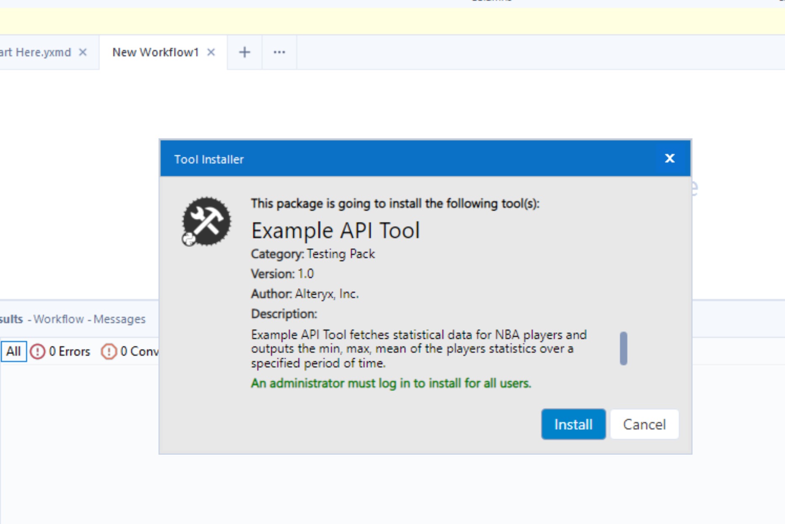
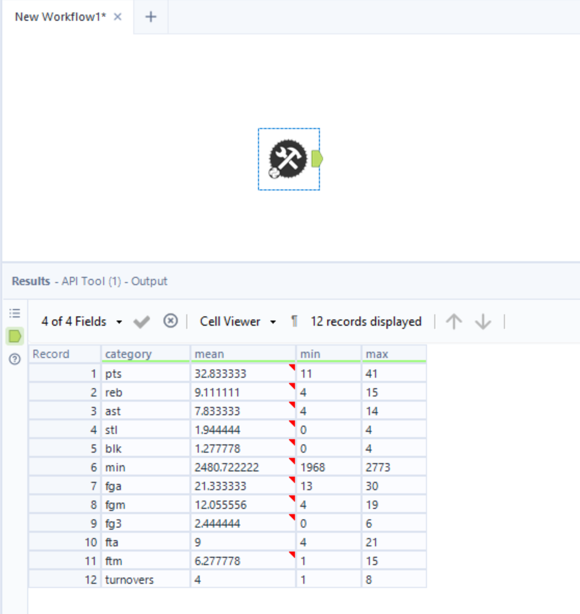

# Create a Tool with an API Hit
In this guide, we use the [Alteryx Python SDK](https://pypi.org/project/ayx-python-sdk/) and [Alteryx Plugin CLI](https://pypi.org/project/ayx-plugin-cli/) to create a tool that pulls information from an API and finds the mean, min, and max values of the data.

Table of Contents:
- [Workspace Setup](#workspace-setup)
    - [Create a Workspace](#1-create-a-workspace)
    - [Create a Plugin](#2-create-a-plugin)
- [Write API Request Tool](#write-api-request-tool)
    - [Make the Request](#1-make-the-request)
    - [Create a `pyarrow.Table`](#2-create-a-pyarrowtable)
    - [Get the Min, Max, and Mean](#3-get-the-min-max-and-mean)
    - [Putting It All Together](#4-putting-it-all-together)
- [Package into a YXI](#package-into-a-yxi)
- [Run Against Test Client](#run-against-test-client)
- [Install and Run in Designer](#install-and-run-in-designer)
    - [Method 1](#method-1)
    - [Method 2](#method-2)
## Workspace Setup
---
A plugin workspace is the project folder that houses all of your SDK plugins and metadata, managed by the `ayx_workspace.json` file.

### 1. Create a Workspace
The first step of plugin creation is to make a plugin workspace. To initialize the plugin workspace, we first create a new, empty directory. Then, we run the `sdk-workspace-init` command inside that directory. Fill out the prompts, which then starts the workspace initialization process.

```sh
~$ mkdir sdk-api-tool
~$ cd ./sdk-api-tool/
~/sdk-api-tool$ ayx_plugin_cli sdk-workspace-init
Package Name: API Tool
Tool Category [Python SDK Examples]: Python SDK Examples
Description []: API Tool
Author []: Alteryx
Company []: Alteryx
Backend Language (python): python
[Workspace initialization] started
[Workspace initialization] .  Create configuration directory
[Workspace initialization] .  Create DCM Schemas directory
[Workspace initialization] .  Create .gitignore
[Workspace initialization] .  Create README.md
[Workspace initialization] .  Initialize backend
[Workspace initialization] Creating ~\sdk-api-tool\backend\ayx_plugins
[Workspace initialization] Creating file ~\sdk-api-tool\backend\requirements-local.txt
[Workspace initialization] Creating file ~\sdk-api-tool\backend\requirements-thirdparty.txt
[Workspace initialization] Creating file ~\sdk-api-tool\backend\setup.py
[Workspace initialization] Creating file ~\sdk-api-tool\backend\ayx_plugins\__init__.py
[Workspace initialization] .  Create tests directory
[Workspace initialization] .  Initialize UI
[Workspace initialization] finished
Created Alteryx workspace in directory: ~\sdk-api-tool
Workspace settings can be modified in: ayx_workspace.json
[Generating config files] started
[Generating config files] .  generate_config_files:generate_config_xml
[Generating config files] Generating top level config XML file...
[Generating config files] finished
```

### 2. Create a Plugin
The next step is to add a plugin to the workspace. To do so, use the `create-ayx-plugin` command. Reply to the prompts and then you will have the template code for your SDK Plugin. For this tool, we use the `Input` tool type.

```bash
~/sdk-api-tool$ ayx_plugin_cli create-ayx-plugin
Tool Name: API tool
Tool Type (input, multiple-inputs, multiple-outputs, optional, output, single-input-single-output, multi-connection-input-anchor) [single-input-single-output]: input
Description []: My API Tool
Tool Version [1.0]: 1.0
DCM Namespace []:
Creating input plugin: API tool
[Create plugin] started
[Create plugin] Downloading UI components via git
[Create plugin] Cloning into '.ayx_cli.cache\ui_tool_template'...
[Create plugin] .  Create plugin
[Create plugin] Installing UI components via npm
[Create plugin] Creating Alteryx Plugin...
[Create plugin] Copying example tool to ~\sdk-api-tool\backend\ayx_plugins...
[Create plugin] Added new tool to package directory: ~\sdk-api-tool\backend\ayx_plugins\a_p_i_tool.py
[Create plugin] finished
[Generating config files] started
[Generating config files] .  generate_config_files:generate_config_xml
[Generating config files] Generating top level config XML file...
[Generating config files] .  generate_config_files:generate_tool_config_xml
[Generating config files] Generating tool configuration XMLs...
[Generating config files] Generating APItool XML...
[Generating config files] Done!
[Generating config files] .  generate_config_files:generate_manifest_jsons
[Generating config files] Generating manifest.json for APItool...
[Generating config files] Done!
[Generating config files] finished
[Generating test files for APItool] started
[Generating test files for APItool] .  Generate tests
[Generating test files for APItool] finished
```

After this command finishes, you will see a file named `a_p_i_tool.py` under `~/backend/ayx_plugins/` with the boilerplate code. When you open the file, you should see something like this:

```python
    class APITool(PluginV2):
        """Concrete implementation of an AyxPlugin."""

        def __init__(self, provider: AMPProviderV2) -> None:
            self.provider = provider
            # truncated code

        def on_incoming_connection_complete(self, anchor: namedtuple) -> None:
            # truncated code

        def on_record_batch(self, batch: "Table", anchor: namedtuple) -> None:
            # truncated code

        def on_complete(self) -> None:
            import pandas as pd
            import pyarrow as pa

            df = pd.DataFrame(
                {
                    "x": [1, 2, 3],
                    "y": ["hello", "world", "from ayx_python_sdk!"],
                    "z": [self.config_value, self.config_value, self.config_value],
                }
            )

            packet = pa.Table.from_pandas(df)

            self.provider.write_to_anchor("Output", packet)
            self.provider.io.info("APITool tool done.")
```
## Write API Request Tool
---
Now you are ready to modify this plugin code to pull data from an API and tell the plugin to output it! In our example, we use the [requests](https://requests.readthedocs.io/en/latest/) library to do this.

> :information_source: Since this is an input tool, we only focus on the `on_complete` function. For additional information on the lifecycle of a plugin, refer to the [AYX Python SDK documentation](https://alteryx.github.io/ayx-python-sdk/plugin_lifecycle.html)

### 1. Make the Request
In this example, we fetch 2016 NBA playoff statistics data for Lebron James from the [BALLDONTLIE API](https://app.balldontlie.io)

First, we want to remove the existing boilerplate code in the `on_complete` function, and leave only the `import pyarrow as pa` line. Your code should now look like this:

```python
    def on_complete(self) -> None:
        import pyarrow as pa
        import pyarrow.compute as pc # add this line in, it will be used later
```

Next, we write a function to make a GET request to the API. We pass in Lebron James' `player_id` and `season`:
```python
    def get_postseason_stats(player_id=237, season=2016):
        resp = requests.get(
            "https://www.balldontlie.io/api/v1/stats",
            params={
                "player_ids[]": player_id,
                "postseason": True,
                "seasons[]": season,
            },
        )
        return resp.json()["data"]
```
When we call this function with `player_id=237` and `season=2016`, we get the data back as a JSON.
After we return the JSON data, we can read that into a [`pyarrow.Table`](https://arrow.apache.org/docs/python/generated/pyarrow.Table.html)

### 2. Create a `pyarrow.Table`
Since we read and write data in the [Apache Arrow](https://arrow.apache.org/) data format, we need to convert this JSON to `pyarrow.Table` format with this function:

```python
    def get_pyarrow_table_from_stats(stats_json):
        stats_schema = pa.schema([
            pa.field("pts", pa.int64()),
            pa.field("reb", pa.int64()),
            pa.field("ast", pa.int64()),
            pa.field("stl", pa.int64()),
            pa.field("blk", pa.int64()),
            pa.field("min", pa.duration('s')),
            pa.field("fga", pa.int64()),
            pa.field("fgm", pa.int64()),
            pa.field("fg3", pa.int64()),
            pa.field("fta", pa.int64()),
            pa.field("ftm", pa.int64()),
            pa.field("turnovers", pa.int64()),
        ])
        assists = []
        blocks = []
        rebounds = []
        minutes = []
        points = []
        steals = []
        fga = []
        fgm = []
        fg3 = []
        fta = []
        ftm = []
        tos = []
        for stat in stats_json:
            assists.append(stat["ast"])
            blocks.append(stat["blk"])
            rebounds.append(stat["reb"])
            mins, secs = stat["min"].split(":")
            mins_in_secs = int(mins)*60 + int(secs)
            minutes.append(mins_in_secs)
            points.append(stat["pts"])
            steals.append(stat["stl"])
            fga.append(stat["fga"])
            fgm.append(stat["fgm"])
            fg3.append(stat["fg3m"])
            fta.append(stat["fta"])
            ftm.append(stat["ftm"])
            tos.append(stat["turnover"])
        
        table = pa.table(
            [points, rebounds, assists, steals, blocks, minutes, fga, fgm, fg3, fta, ftm, tos],
            schema=stats_chema
        )
        return table
```
This function iterates over the returned JSON from step 1 and pulls the relevant fields into an array of arrays, which conforms to the [`pa.schema`](https://arrow.apache.org/docs/python/generated/pyarrow.Schema.html) that we defined in the beginning of the function.

> In this example, the JSON data that is returned from the API can't be automatically parsed. Generally, we can avoid manual conversion to Apache Arrow format with the [built-in helper function](https://arrow.apache.org/docs/python/json.html) 
### 3. Get the Min, Max, and Mean 
Now that we have a `pyarrow.Table` representation of the JSON data, we can use the built-in [compute functions](https://arrow.apache.org/docs/python/compute.html) to calculate the min, max, and mean of each of our statistical categories with this function:

```python
    def compute_aggregate_output(table):
        mins = []
        maxs = []
        means = []
        cat = []
        for stat, col_name in zip(table, table.column_names):
            if stat.type == pa.duration('s'):
                stat = stat.cast(pa.int64())
            min_max = pc.min_max(stat)
            mins.append(min_max[0].as_py())
            maxs.append(min_max[1].as_py())
            means.append(pc.mean(stat).as_py())
            cat.append(col_name)
        
        aggregate_tables = [cat, means, mins, maxs]

        return pa.table(aggregate_tables, names = ["category", "mean", "min", "max", ])
```

This function calls the compute function `pc.min_max()` and `pc.mean()` on each statistical category of the `pa.Table` that we created in step 2. It then aggregates all of these into a new table and returns that table.

### 4. Putting It All Together
Finally, we combine everything we did in steps 1-3 into the `on_complete` function and write the results to the output anchor. It should look like this:

```python
    def on_complete(self) -> None:
        """
        In this method, a Plugin designer should perform any cleanup for their plugin.
        However, if the plugin is an input-type tool (it has no incoming connections),
        processing (record generation) should occur here.
        """
        import pyarrow as pa
        import pyarrow.compute as pc

        LEBRON_JAMES_PLAYER_ID = 237
        NBA_SEASON = 2016
        lbj_stats = get_postseason_stats(LEBRON_JAMES_PLAYER_ID, NBA_SEASON)
        table = get_pyarrow_table_from_stats(lbj_stats)
        output_table = compute_aggregate_output(table)
        self.provider.write_to_anchor("Output", output_table)
        self.provider.io.info("APITool tool done.")
```

And now you're done with writing the code!
## Package into a YXI 
---
Back in our plugin workspace, run the `ayx_plugin_cli create-yxi` command which bundles all the plugins in the workspace into a `.yxi` archive. It should look something like this:
```bash
~/sdk-api-tool$ ayx_plugin_cli create-yxi
[Creating YXI] started
[Creating YXI] -- generate_config_files:generate_config_xml
[Creating YXI] -- generate_config_files:generate_tool_config_xml
[Creating YXI] .  generate_config_files:generate_manifest_jsons
[Creating YXI] Generating manifest.json for APItool...
[Creating YXI] Done!
[Creating YXI] .  generate_artifact:build_artifacts
[Creating YXI] Creating APItool.yxi...
[Creating YXI] Creating shiv artifact...
[Creating YXI] [Installing local dependencies]: python -m pip install -r requirements-local.txt --upgrade --target ~\sdk-api-tool\.ayx_cli.cache\dist
[Creating YXI] [Compiling shiv artifact]: shiv --compile-pyc --reproducible --extend-pythonpath --site-packages ~\sdk-api-tool\.ayx_cli.cache\dist -o ~\sdk-api-tool\main.pyz -e ayx_python_sdk.providers.amp_provider.__main__:main
[Creating YXI] Created shiv artifact at: ~\sdk-api-tool\main.pyz
[Creating YXI] .  create_yxi:create_yxi
[Creating YXI] finished
```
## Run Against Test Client
---
After we create the `.yxi` and before we install it into Designer, we can first run our plugin against the Test Client to make sure there are no errors and that our plugin runs as expected. 
Doing so speeds up development time since we don't have to package and install the `.yxi` into Designer and create a new workflow every time we make changes to our plugin code. 

Run the `.yxi` against the Test Client with this command:

```bash
$ ayx-sdk-cli.exe plugin run APITool -o output.json
```

This outputs the results to a file called `output.json`.[^1] 

## Install and Run in Designer
---
In this section we will go over the two ways to install the plugin into Designer.
### Method 1
After you create a `.yxi`, you can double-click the `.yxi` to install it into Designer. This opens Designer and prompt you to install the package in a new dialog box. It looks something like this:



Once it installs, you can find the plugin under the `Python SDK Examples` tool category.[^2]

### Method 2
You can also create the yxi _**and**_ install it all at once via the `ayx_plugin_cli designer-install` command. Choose the install option that matches your Designer install. Typically, this will be the `user` install option. 

```bash
~/sdk-api-tool$ ayx_plugin_cli designer-install
Install Type (user, admin) [user]: user
[Creating YXI] started
[Creating YXI] -- generate_config_files:generate_config_xml
[Creating YXI] -- generate_config_files:generate_tool_config_xml
[Creating YXI] .  generate_config_files:generate_manifest_jsons
[Creating YXI] Generating manifest.json for APItool...
[Creating YXI] Done! 
[Creating YXI] .  generate_artifact:build_artifacts
[Creating YXI] Creating APItool.yxi...   # <-- .yxi generated here
[Creating YXI] Creating shiv artifact...
[Creating YXI] [Installing local dependencies]: python -m pip install -r requirements-local.txt --upgrade --target ~\sdk-api-tool\.ayx_cli.cache\dist
[Creating YXI] [Compiling shiv artifact]: shiv --compile-pyc --reproducible --extend-pythonpath --site-packages ~\sdk-api-tool\.ayx_cli.cache\dist -o ~\sdk-api-tool\main.pyz -e ayx_python_sdk.providers.amp_provider.__main__:main
[Creating YXI] Created shiv artifact at: ~\sdk-api-tool\main.pyz
[Creating YXI] .  create_yxi:create_yxi
[Creating YXI] finished
[Installing yxi ~\sdk-api-tool\build\yxi\APItool.yxi into designer] started
[Installing yxi ~\sdk-api-tool\build\yxi\APItool.yxi into designer] .  install_yxi
[Installing yxi ~\sdk-api-tool\build\yxi\APItool.yxi into designer] finished
If this is your first time installing these tools, or you have made modifications to your ayx_workspace.json file, please restart Designer for these changes to take effect. # <-- Done installing into Designer!
```

Once the command finishes you can open Designer and find your tool under the `Python SDK Examples` tab.[^2] 

When you run this tool in Designer it yields the following output:



We can see from the output that Lebron James averaged 32.8 points, 9.1 rebounds, and 7.9 assists in the 2016 Playoffs.

Thanks for reading!

> [^1]: :information_source: You can also specify a `.csv` extension for the output format by passing `output.csv` to the `-o` flag.

> [^2]: :warning: If you created the plugin workspace with a non-default `Tool Category` (from the [Create a Workspace](#1-create-a-workspace) section), then the plugin will show up in the tab that corresponds to the input that was passed to `Tool Category`