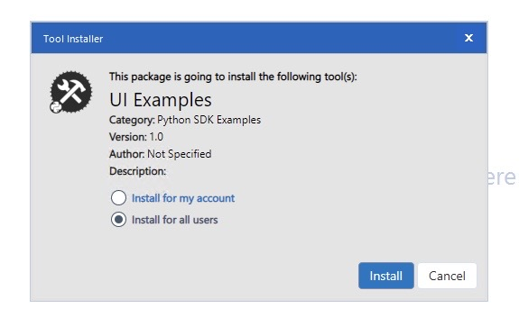
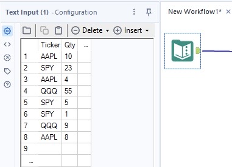
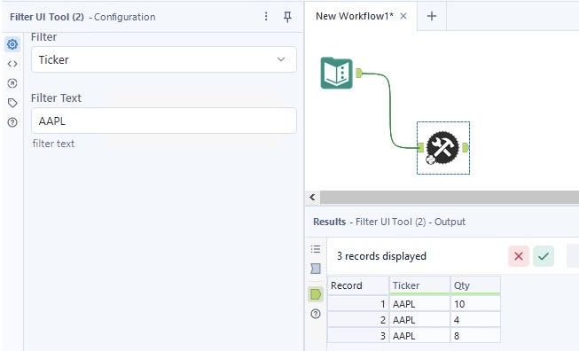

# Create a Simple Filter Tool with a UI
In this guide, we use the [Alteryx Python SDK](https://pypi.org/project/ayx-python-sdk/), [Alteryx UI-SDK](https://github.com/alteryx/dev-harness), and [Alteryx Plugin CLI](https://pypi.org/project/ayx-plugin-cli/) to create a tool that illustrates how to:

- Read metadata from an upstream tool.
- Use a [TextField](https://alteryx.github.io/alteryx-ui/#/Components/TextField) UI Component.
- Use an [Autocomplete](https://alteryx.github.io/alteryx-ui/#/Components/Autocomplete) UI Component which acts as a dropdown.
- Work with data sent from the UI-SDK to the Python SDK.

Table of Contents:
- [Prerequisites](#prerequisites)
- [Overview](#overview)
- [Workspace Setup](#workspace-setup)
  - [Create a Workspace](#1-create-a-workspace)
  - [Create a Plugin](#1-create-a-plugin)
- [Create the UI](#create-the-ui)
  - [Create the Default Configuration](#1-create-the-default-configuration)
  - [Read Metadata from Upstream Tools](#2-read-metadata-from-upstream-tools)
  - [Create Handlers Which Deal With Component Changes](#3-create-handlers-which-deal-with-component-changes)
  - [Create the Main Components](#4-create-the-main-components)
  - [Summary of the UI](#5-summary-of-the-ui)
- [Create the Backend](#create-the-backend)
  - [Edit the \_\_init\_\_ Function](#6-edit-the-__init__-function)
  - [Edit the on_record_batch Function](#7-edit-the-on_record_batch-function)
  - [Summary of the Back End](#8-summary-of-the-backend)
- [Package into a YXI](#package-into-a-yxi)
- [Install and Run in Designer](#install-and-run-in-designer)
  - [Method 1](#method-1)
  - [Method 2](#method-2)
- [Using the Tool](#using-the-tool)

## Prerequisites
The Alteryx UI-SDK is a collection of [React](https://react.dev/) components. They look very similar to `HTML elements` and their `attributes` but are actually called `components` and `props`, respectively. You don't need prior experience with React, but a basic understanding of [how components work](https://react.dev/learn/passing-props-to-a-component#passing-props-to-a-component) is beneficial. 

## Overview
The tool created in this example is a simple filter tool. The UI consists of a dropdown and a free-form text field. The tool reads all fields from the metadata of a single upstream tool and poplulates the dropdown in the UI with those fields. Then, it uses the selected field to filter the data. The string in the `TextField` is used to _filter in_ rows.

## Workspace Setup
---
A plugin workspace is the project folder that houses all of your SDK plugins and metadata, managed by the `ayx_workspace.json` file.

### 1. Create a Workspace
The first step of plugin creation is to make a plugin workspace. To initialize the plugin workspace, we create a new, empty directory. Then, we run the `sdk-workspace-init` command inside that directory and fill out the prompts, which starts the workspace initialization process.

```powershell
$ mkdir sdk-filter-ui-tool
$ cd ./sdk-filter-ui-tool/
sdk-filter-ui-tool $ ayx_plugin_cli sdk-workspace-init
Package Name: Filter UI Tool
Tool Category [Python SDK Examples]: Python SDK Examples
Description []: Filter UI Tool Example
Author []: Alteryx
Company []: Alteryx
Backend Language (python): python
[Workspace initialization] started
[Workspace initialization] .  Create configuration directory
// output truncated //
[Generating config files] started
[Generating config files] .  generate_config_files:generate_config_xml
[Generating config files] Generating top level config XML file...
[Generating config files] finished
```

### 2. Create a Plugin
The next step is to add a plugin to the workspace. To do so, use the `create-ayx-plugin` command. Reply to the prompts and then you will have the template code for your SDK Plugin. For this tool, we use the `single-input-single-output` tool type, which is the default.

```powershell
sdk-filter-ui-tool $ ayx_plugin_cli create-ayx-plugin
Tool Name: Filter UI Tool
Tool Type (input, multiple-inputs, multiple-outputs, optional, output, single-input-single-output, multi-connection-input-anchor) [single-input-single-output]:
Description []: Example tool with UI
Tool Version [1.0]:
DCM Namespace []:
Creating single-input-single-output plugin: Filter UI Tool
[Create plugin] started
[Create plugin] .  Create plugin
[Create plugin] Installing UI components via npm
[Create plugin] Creating Alteryx Plugin...
// output truncated //
[Generating test files for FilterUITool] finished
```

After this command finishes, the `filter_u_i_tool.py` file is available under `backend/ayx_plugins/` and the `index.tsx` file is available under `ui/FilterUITool/src` (with boilerplate code). When you open the files, you should see something like this:

#### ui/FilterUITool/Index.tsx
```jsx
const App = () => {
  const classes = useStyles();
  const [model, handleUpdateModel] = useContext(UiSdkContext);

  useEffect(() => {
    handleUpdateModel(model)
  }, []);

  return (
    <Box p={4}>
     <Grid container spacing={4} direction="column" alignItems="center">
        <Grid item>
          <Alteryx className={classes.alteryx} />
        </Grid>
        <Grid item>
          <Typography variant="h3">
            To get started, edit src/index.tsx
          </Typography>
        </Grid>
      </Grid>
    </Box>
  )
}

const Tool = () => {
  return (
    <DesignerApi messages={{}}>
      <AyxAppWrapper> 
        <App />
      </AyxAppWrapper>
    </DesignerApi>
  )
}

ReactDOM.render(
  <Tool />,
  document.getElementById('app')
);
```

#### backend/ayx_plugins/filter_u_i_tool.py
```python
class FilterUITool(PluginV2):
    """A sample Plugin that passes data from an input connection to an output connection."""

    def __init__(self, provider: AMPProviderV2):
        """Construct the plugin."""
        self.name = "FilterUITool"
        self.provider = provider
        self.provider.io.info(f"{self.name} tool started")

    def on_record_batch(self, batch: "pa.Table", anchor: Anchor) -> None:
        # truncated code

    def on_incoming_connection_complete(self, anchor: Anchor) -> None:
        # truncated code

    def on_complete(self) -> None:
        # truncated code
```

## Create the UI
First, you will modify the React UI to read metadata from the upstream tool.

### 1. Create the Default Configuration
When you design an app for Alteryx Designer, [DesignerApi Component](https://alteryx.github.io/react-comms/#/Designer%20Api) is required. This allows you to send data from the UI to the Python SDK easily. We set the `defaultConfig` prop to load default values, in this case, blank strings. The back-end code requires these 2 values, which are the field on which to apply the filter and the filter string.

You must wrap all UI-SDK-related components in the `AyxAppWrapper` component. In this case, this wraps the `App` component, which contains all of the front-end logic.

Update the Tool function as shown below.

```jsx
const Tool = () => {
  return (
    <DesignerApi messages={{}} defaultConfig={{ Configuration: { field: '', filterText: '' } }}>
      <AyxAppWrapper> 
        <App />
      </AyxAppWrapper>
    </DesignerApi>
  )
}
```

This sets our default values to empty strings.

### 2. Read Metadata from Upstream Tools
Replace this unnecessary boilerplate code:

```jsx
useEffect(() => {
  handleUpdateModel(model)
}, []);
```

with 
```jsx
if (Array.isArray(model.Meta)) {
  return null;
}

const fields = model.Meta.fields[0][0].fields.map(field => field.name);
```

In some cases, `App` is rendered without metadata properly set (as an object). In these cases, we simply return null. When metadata is properly set, we copy the field names into an array of strings to use in the `Autocomplete` component.

### 3. Create Handlers Which Deal with Component Changes
The UI-SDK is comprised or React _functional components_, which generally don't deal with state directly. The idiomatic approach is to use a handler to detect component changes and store values. Add the following 2 handlers in the `App` function, before the return statement.

```jsx
const onChangeField = text => {
  const newModel = { ...model }
  newModel.Configuration.field = text;
  handleUpdateModel(newModel);
}

const onChangeText = name => event => {
  const newModel = { ...model }
  newModel.Configuration.filterText = event.target.value;
  handleUpdateModel(newModel);
}
```

Although slightly different, each of these handlers serves the same purpose. They...
- Are called when a component is updated.
- Copy the model.
- Update a specific value in the model.
- Update the model via `handleUpdateModel()`.

### 4. Create the Main Components

To make the widgets fill the whole panel, create the following style just above the `App` component in `index.tsx`. We will add it to our components later.

Replace
```jsx
const useStyles = makeStyles((theme: Theme) => ({
  alteryx: {
    color: theme.palette.brand.corporateBlue,
    height: '125px',
    width: '125px'
  }
}));
```
with
```jsx
const useStyles = makeStyles({
  autoSize: {
    width: 300
  }
});
```

Then ensure you import the `Autocomplete` and `TextField` components. To do so, add them to the correct import command.

```jsx
import { AyxAppWrapper, Grid, makeStyles, Theme, Autocomplete, TextField } from '@alteryx/ui';
```

Then replace the `App` function's return statement with this:

```jsx
return (
  <Grid container justify="center" spacing={4}>
    <Grid item>
      <Autocomplete
        value={model.Configuration.field}
        className={classes.autoSize}
        getOptionLabel={option => option}
        options={fields}
        renderInput={params => <TextField {...params} fullWidth label="Filter" />}
        onChange={(_, newValue) => {onChangeField(newValue)}}
       />
    </Grid>
    <Grid item>
       <TextField
         className={classes.autoSize}
         fullWidth
         helperText="filter text"
         inputLabelProps={{
          shrink: true
         }}
         label="Filter Text"
         style={{margin: 8}}
         onChange={onChangeText('name')}
         value={model.Configuration.filterText}
       />
    </Grid>
  </Grid>
);
```

To cover every aspect of the above code is beyond the scope of this document, but note that we use a [Grid](https://alteryx.github.io/alteryx-ui/#/Layout/Grid) to manage the layout of the components, an [Autocomplete](https://alteryx.github.io/alteryx-ui/#/Components/Autocomplete) to act as a dropdown, and a [TextField](https://alteryx.github.io/alteryx-ui/#/Components/TextField) for free-form text input.

The most important pieces to take note of are the `value` and the `onChange` props in both the `Autocomplete` and `Textfield` components. The `value` prop determines the value that populates when the components render, while `onChange` is the function called (from step 3) when the value changes.

The `options` prop of the `Autocomplete` is given the string array `fields` which we populated in step 2.

> :information_source: React functional components must return a single `JSX.Element`. In the above code, it's a `Grid` component.

### 5. Summary of the UI

The UI for our tool is complete. The `App` functional component reads metadata from the upstream tool and uses 2 components for user input. It also has the requierd handlers to transfer the data to the Python SDK.

## Create the Back End

We will now write the code in our back end to pick up the fields set in the UI, and properly apply them.

### 6. Edit the \_\_init\_\_ Function

In our plugin's `__init__` member function, we will read the 2 values set in the components we created in the previous steps. Add this code to the `__init__` function:

```python
self.field = self.provider.tool_config.get("field") or ""
if not len(self.field):
    self.provider.io.warn("No field selected. No records will be allowed through")

self.filter_text = self.provider.tool_config.get("filterText") or ""
if not len(self.filter_text):
    self.provider.io.warn("No filter text selected. No records will be allowed through")
```

We use the provider's `tool_config`, which is a `Dictionary`, to get the values of both `field` and `filterText` and store them for later use. We issue a warning (which diplays in Designer's Results window) if either is missing. 

### 7. Edit the on_record_batch Function

Each time we receive a record batch, we want to filter out any rows which don't match our filter criteria. For this example, we will use arrow's functionality to filter the `pyarrows.Table`.

Make sure to import RecordBatch from pyarrow.

```python
from pyarrow import RecordBatch
```

Replace
```python
self.provider.write_to_anchor("Output", batch)
```
with
```python
filtered_table = batch.filter(pc.match_like(batch[self.field], self.filter_text))
self.provider.write_to_anchor("Output", filtered_table)
```

### 8. Summary of the Back End

The back end simply reads the values set from the UI in `__init__` and uses them in `on_record_batch`. Now you're ready to build and use the tool.

## Package into a YXI

Run the `ayx_plugin_cli create-yxi` command which bundles all the plugins in the workspace into a `.yxi` archive. It should look something like this:
```powershell
$ create-yxi
[Creating YXI] started
[Creating YXI] -- generate_config_files:generate_config_xml
// output truncated //
[Creating YXI] .  create_yxi:create_yxi
[Creating YXI] finished
```

The resulting `.yxi` archive should be located in the `build/yxi` directory of your plugin workspace.

## Install and Run in Designer

### Method 1
After you create a `.yxi`, you can double-click the `.yxi` or drag and drop it into Designer to install it. This prompts you to install the package in a new dialog box. Which looks something like this:



Once it installs, you can find the plugin under the `Python SDK Examples` tool category.

### Method 2
You can also create the `.yxi` _**and**_ install it all in one step via the `designer-install` command. Choose the install option that matches your Designer install. Typically, this is the `user` install option. 

```powershell
$ designer-install
Install Type (user, admin) [user]: user
[Creating YXI] started
[Creating YXI] -- generate_config_files:generate_config_xml
// output truncated //
[Installing yxi D:\src\tmp\build\yxi\FilterUITool.yxi into designer] finished
If this is your first time installing these tools, or you have made modifications to your ayx_workspace.json file, please restart Designer for these changes to take effect.
```

Once the command finishes, you can open Designer and find your tool under the `Python SDK Examples` tool category.


## Using the Tool

To show how the tool works, use a `Text Input` tool to enter some data and connect it to the UI Filter Tool.

Drop a `Text Input` tool on the canvas, and enter data similar to the data shown below.



Drop a `Filter UI Tool` on the canvas and connect its input to the output of the `Text Input` tool. After you select the `Filter UI` tool, its configuration UI displays in the left panel. Select `Ticker` from the Filter `Autocomplete`, and enter `AAPL` in the Filter Text `TextInput`.

Next, run the workflow. After you run the workflow, the output window should show only the 3 rows containing `AAPL` in the Ticker column.



You can find the full code for this example at [TODO post link to examples].