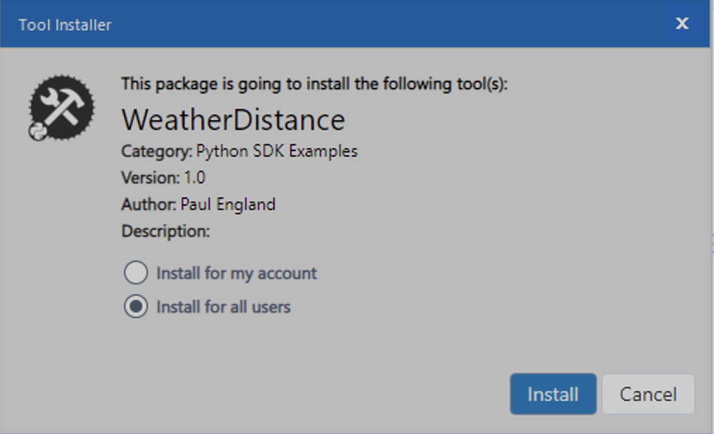
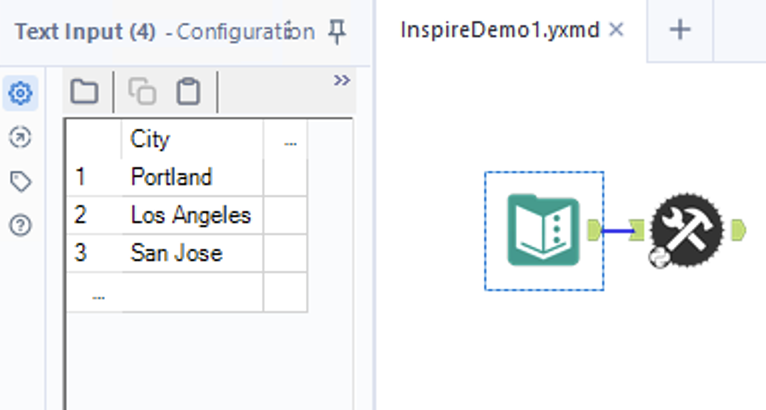
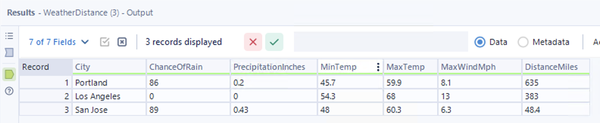

# Distance Matrix Weather Tool
In this guide, we use the [Alteryx Python SDK](https://pypi.org/project/ayx-python-sdk/) and [Alteryx Plugin CLI](https://pypi.org/project/ayx-plugin-cli/) to create a tool that connects directly to 2 public APIs and gathers the weather forecast for, and distance to, nearby cities. We then use this information to determine the best locations to hold promotional events.

> Suppose you're an analyst for a retail chain and need to give advice on when to hold a promotion for a specific product in the region. Historically, people tend to stay home when the weather is bad, so you want to use the forecast to determine the best cities in which to hold the next promotion.

The weather forecast is available in JSON format from [WeatherAPI](https://www.weatherapi.com/), and the travel distance, also in JSON, is available from [Google Maps' Distance Matrix API](https://developers.google.com/maps/documentation/distance-matrix/overview). The combined data from the 2 sources will help determine a suitable location.

We use the `requests` package to make HTTP requests to both of both of these APIs.

Parsing JSON in Python is relatively straightforward but can become quite verbose with deeply nested objects. To alleviate this, we use the [jsonpath-rw-ext](https://pypi.org/project/jsonpath-rw-ext/) package, which allows you to parse JSON with a regular expression style syntax.

## Table of Contents
* [Get WeatherAPI key](#get-weatherapi-key)
* [Get Google Maps API Key](#get-google-maps-api-key)
* [Basic Plugin Setup](#basic-plugin-setup)
* [Write a Plugin](#write-a-plugin)
    * [Dependencies](dependencies)
    * [Imports](imports)
    * [Initialization](initialization)
    * [Weather API Function](weather-api-function)
    * [Distance Matrix API Function](distance-matrix-api-function)
    * [Data Processing](data-processing)
    * [Putting It All Together](putting-it-all-together)
* [Packaging into a YXI](#packaging-into-a-yxi)
* [Run the Test Client](#run-the-test-client)
* [Install in Designer](#install-in-designer)
    * [Method 1](#method-1)
    * [Method 2](#method-2)
* [Run in Designer](#run-in-designer)

## Get WeatherAPI Key
[WeatherAPI](weatherapi.com) offers weather data via a JSON RESTful API. While it is free, it does require an API key to make requests. Sign up to get an API key which will be used in this demo.

## Get Google Maps API Key
The [Google Maps Distance Matrix API](https://developers.google.com/maps/documentation/distance-matrix/overview) also requires an API key, which requires a Google billing account. While it's technically not a free API, there is an automatic credit of \$200 applied each month. For non GCP users, there is a trial in which \$300 worth of API calls can be consumed, without charge. With the first 100,000 API calls running $0.005, this will be quite hard to breach. 

You can generate an API key from the Credentials tab on the [GCP API's and Services](https://console.cloud.google.com/apis/credentials) page.

## Basic Plugin Setup
Before you proceed, please ensure you have this basic setup:

1. [Create a Workspace](../create-a-workspace.md) to house your plugin.
2. [Add a new plugin](./.create-a-plugin.md).
    1. When prompted choose the single-input-single-output (default) plugin type.
    2. To match what is found in this guide, choose **WeatherDistance** as the plugin name.

After you run the above setup procedures, you will have a file named `weather_distance.py` under `./backend/ayx_plugins` with a generated boilerplate. When you open the file, you should see something like this:

```python
class WeatherDistance(PluginV2):
    """Concrete implementation of an AyxPlugin."""

    def __init__(self, provider: AMPProviderV2):
        """Construct the plugin."""
        self.name = "Weather Distance"
        # truncated code

    def on_record_batch(self, batch: "pa.Table", anchor: Anchor) -> None:
        self.provider.write_to_anchor("Output", batch)

    def on_incoming_connection_complete(self, anchor: Anchor) -> None:
        self.provider.io.info(
            f"Received complete update from {anchor.name}:{anchor.connection}."
        )

    def on_complete(self) -> None:
        self.provider.io.info(f"{self.name} tool done.")
```
## Write a Plugin
### Dependencies
The first step is to update the `./backend/requirements-thirdparty.txt` file and tell Python that we depend on `jsonpath_rw_ext` as a 3rd-party dependency. At the time of this writing, 1.2.2 is the current stable version. Add this line to the file:
```txt
jsonpath_rw_ext==1.2.2
```

The second step is to pip install all of the imports found in `./backend/requirements-thirdparty.txt`.
``` 
pip install -r requirements-thirdparty.txt
```

> :information_source: Note that we don't have to add `requests` to the requirements file, as it's already a dependency of the Python SDK.

### Imports
The next step is to update the Python module's imports. Imports tell Python what other code the plugin references. Add the required import statements near the top of your `weather_distance.py` file. Your code should look like this:

```python
import re
from typing import List

from ayx_python_sdk.core import (
    Anchor,
    PluginV2,
)
from ayx_python_sdk.providers.amp_provider.amp_provider_v2 import AMPProviderV2

import pyarrow as pa
import requests
import jsonpath_rw_ext as jp_ext
```

> :information_source: Note that `pyarrow as pa` is imported in the default plugin only if TYPE_CHECKING is true. This should be changed to import always.

### Initialization
Now, it's time to update the plugin's `__init__` method and set up some basic variables that we reference later in the code. 

```python
def __init__(self, provider: AMPProviderV2):
    self.name = "Weather Distance"
    self.provider = provider
    self.set_output = False 

    self.forecast_endpoint = "http://api.weatherapi.com/v1/forecast.json"
    self.weather_key = "[Your WeatherAPI key here]"

    self.distance_endpoint = "https://maps.googleapis.com/maps/api/distancematrix/json"
    self.origin = "San Francisco"
    self.units = "imperial"
    self.distance_key = "[Your Google Maps key here]"
    
    self.provider.io.info(f"{self.name} tool started")
```
> :information_source: Protect your API keys! They are included here for ease of use and the assumption is that nobody will look at your version of the code. If you need to check your code int into version control, make sure to remove your keys!

### Weather API Function
To keep our code clean, we will write a function called `_get_weather` that takes a destination city, and calculates the distance from our origin which we set in the intialization step.

We first use the `requests` library to make a GET request to the `WeatherAPI` REST endpoint, passing our destination, the number of days we're interested in (1), and our key as parameters. 

With the results, we will use the `jsonpath_ext_rw` library to get the value we want out of the response with just a couple of lines of code.

A very truncated example response might look like this:
```json
{
    "location": {
        "name": "London",
        "region": "City of London, Greater London",
        "country": "United Kingdom",
    },
    "current": {
        "condition": {
            "text": "Partly cloudy",
            "icon": "//cdn.weatherapi.com/weather/64x64/day/116.png",
            "code": 1003
        },
    },
    "forecast": {
        "forecastday": [
            {
                "date": "2023-05-02",
                "date_epoch": 1682985600,
                "day": {
                    "mintemp_f": 52,
                    "maxtemp_f": 75,
                    "totalprecip_in": 0.33,
                    "maxwind_mph": 15,
                    "daily_will_it_rain": 1,
                    "daily_chance_of_rain": 74,
                },
            }
        ]
    }
}
```
You can see the entire response in [forecast.json](./assets/forecast.json).

Notice how the values we want, `daily_chance_of_rain`, `maxwind_mph`, etc, are several levels deep in the JSON response. In Python can access this value with:

```python
return json["forecast"]["forecastday"][0]["day"]["daily_chance_of_rain"]
```

However, this is far from robust. If the response is empty because, for example, the user misspells a city name, the plugin would throw an error.

We can also do a check for `None` for each key or index until we reach the key we're interested in, but this quickly becomes quite verbose.

A better solution is to use the `jsonpath_ext_rw` library, as shown in the code below.

The function does the following:
* Initializes the dictionary it will return
* Makes the GET request using the requests libray.
* Checks that request's return code was successful.
* Populates the JSON returned from the GET request to a Dictionary.
* For each `dayKey`, gets the desired values from the response body and puts them in the return dictionary.

```python
    def _get_weather(self, destination, dayKeys: List[str]) -> dict:
        ret = {}

        params = {
            "q": destination,
            "days": 1,
            "key": self.weather_key
        }

        r = requests.get(self.forecast_endpoint, params)

        if r.status_code != 200:
            self.provider.io.warn("_get_weather(%s) received error response %d" % (q, r.status_code))
            for key in dayKeys:
                ret[key] = None
            return ret

        json = r.json()

        for key in dayKeys:
            match = jp_ext.match('forecast.forecastday[0].day.%s' % key, json)
            if (match and len(match) == 1):
                ret[key] = match[0]

        return ret
```
### Distance Matrix API Function

The `_get_distance` function does the same steps as the `_get_chance_of_rain` function. The main difference is we set the return value to -1.0 and of course make the request to Google Maps.

Also note that the distance values returned in this API are "8 mi", "12.5 mi", etc. So we use a regular expression to extract only the numeric value and convert it from a string to a float. 

The code looks like this:

```python
    def _get_distance(self, destinationCity) -> float:
        ret = -1.0

        params = {
            "destinations": destinationCity,
            "origins": self.origin,
            "units": self.units,
            "key": self.distance_key
        }
        r = requests.get(self.distance_endpoint, params)
        
        if r.status_code != 200:
            self.provider.io.error("get_distance received error response " + str(r.status_code))
            return ret

        json = r.json()
        match = jp_ext.match('$.rows[0].elements.[0].distance.text', json)

        if not match:
            self.provider.io.info("no match")
            return ret

        if (len(match) == 1):
            self.provider.io.info("match %s" % match[0])
            re_match = re.search('(?P<dist>(.+)) mi', match[0])
            if re_match:
                ret = float(re_match.group("dist"))
                self.provider.io.info("Got %f from %s" % (ret, match[0]))

        return ret
```

### Data Processing
Now it's time to get to the core of the plugin. We accept input that has a `City` column and use each city as a destination. We then call `_get_weather` and `_get_distance` for each city.

We store an array of tuples consisting of each
* Destination
* Chance of Rain
* Precipitation in inches
* Minimum Temperature
* Maximum Tempurature
* Maximum Wind Speed
* Distance from the Origin. 

First, we initalize the array we will store the tuples in, then:

* Convert the table to batches and iterate over each batch.
* Convert each batch to a dictionary.
* Get the city from each row, assuming it exists.
* Get the weather details for each destination.
* Get the distance from the origin for each destination.

```python
    def on_record_batch(self, table: "pa.Table", anchor: Anchor) -> None:
        destinations = []

        for batch in table.to_batches():
            d = batch.to_pydict()

            if d.get('City') == None:
                self.provider.io.error("No column named City in in batch")
                return

            for city in zip(d['City']):
                if (city[0] == None):
                    continue
                dest = city[0]
                dayKeys =  ["daily_chance_of_rain", "totalprecip_in", "mintemp_f", "maxtemp_f", "maxwind_mph"]
                weather = self._get_weather(dest, dayKeys)
                distance = self._get_distance(dest)
                destinations.append([dest,
                                     weather[dayKeys[0]] if weather[dayKeys[0]] != None else -1,
                                     weather[dayKeys[1]] if weather[dayKeys[1]] != None else -1,
                                     weather[dayKeys[2]] if weather[dayKeys[2]] != None else -1,
                                     weather[dayKeys[3]] if weather[dayKeys[3]] != None else -1,
                                     weather[dayKeys[4]] if weather[dayKeys[4]] != None else -1,
                                     distance])

```

> :information_source: Note that the function defintiion in the default plugin calls the table a `batch`. We have renamed it to `table` here for clairty when calling `to_batches` explicitly.

At this point, we have all the data we need to publish the records. To do so we...
* Create the schema for the data we will output.
* Create an array of arrays to hold our data.
* Populate the array.
* Convert the array to a pyarrows RecordBatch.
* Send the record bactch to the output anchor.

```python
        schema = pa.schema([
            pa.field("City", pa.string()),
            pa.field("ChanceOfRain", pa.int64()),
            pa.field("PrecipitationInches", pa.float64()),
            pa.field("MinTemp", pa.float64()),
            pa.field("MaxTemp", pa.float64()),
            pa.field("MaxWindMph", pa.float64()),
            pa.field("DistanceMiles", pa.float64())
        ])

        arrays = [[] for _ in schema]

        cst = {
            pa.string(): str,
            pa.int64(): int,
            pa.float64(): float,
        }

        for dest in destinations:
            arrays[0].append(cst[schema[0].type](dest[0]))
            arrays[1].append(cst[schema[1].type](dest[1]))
            arrays[2].append(cst[schema[2].type](dest[2]))
            arrays[3].append(cst[schema[3].type](dest[3]))
            arrays[4].append(cst[schema[4].type](dest[4]))
            arrays[5].append(cst[schema[5].type](dest[5]))
            arrays[6].append(cst[schema[6].type](dest[6]))

        batch = pa.RecordBatch.from_arrays(arrays, schema=schema)
        self.provider.write_to_anchor("Output", batch)  
```

###7. Putting It All Together
The final code is available [here](./WeatherDistance/backend/weather_distance.py).

## Packaging into a YXI
Now that the code is ready, we can package it into a portable YXI archive via the `ayx_plugin_cli create-yxi` command. The process looks like this:

```bash
~/MyWorkspace$ ayx_plugin_cli create-yxi
[Creating YXI] started
[Creating YXI] -- generate_config_files:generate_config_xml
[Creating YXI] -- generate_config_files:generate_tool_config_xml
[Creating YXI] .  generate_config_files:generate_manifest_jsons
[Creating YXI] Generating manifest.json for WeatherDistance...
[Creating YXI] Done!
...omitted...
~\MyWorkspace\main.pyz -e ayx_python_sdk.providers.amp_provider.__main__:main
[Creating YXI] Created shiv artifact at: ~\MyWorkspace\main.pyz
[Creating YXI] .  create_yxi:create_yxi
[Creating YXI] finished
```

## Run the Test Client
[TODO]

## Install in Designer
In this section, we review the 2 ways to install the plugin into Designer.

### Method 1
After you create a .yxi, you can double-click the .yxi to install it in Designer. This opens Designer and prompts you to install the package in a new dialog box. It looks something like this:



Once it installs, you can find the plugin under the `Python SDK Examples` tool category.[^1]

### Method 2
You can also create the `.yxi` _and_ install it all at once via the `ayx_plugin_cli designer-install` command. Choose the install option that matches your Designer install. Typically, this is the `user` install option.
  
     You can also create the .yxi and install it all at once via the ayx_plugin_cli designer-install command. Choose the install option that matches your Designer install. Typically, this is the user install option.

```bash
~/MyWorkspace$ ayx_plugin_cli designer-install
Install Type (user, admin) [user]: user
[Creating YXI] started
[Creating YXI] -- generate_config_files:generate_config_xml
[Creating YXI] -- generate_config_files:generate_tool_config_xml
[Creating YXI] .  generate_config_files:generate_manifest_jsons
[Creating YXI] Generating manifest.json for WeatherDistance...
[Creating YXI] Done!
...omitted...
[Creating YXI] finished
[Installing yxi ~\MyWorkspace\build\yxi\WeatherDistance.yxi into designer] started
[Installing yxi ~\MyWorkspace\build\yxi\WeatherDistance.yxi into designer] .  install_yxi
[Installing yxi ~\MyWorkspace\build\yxi\WeatherDistance.yxi into designer] finished
If this is your first time installing these tools, or you have made modifications to your ayx_workspace.json file, please restart Designer for these changes to take effect. 
```

Once the command finishes, you can open Designer and find your tool under the `Python SDK Examples` tool category.[^1]

## Run in Designer
After the plugin is installed, you can find it in the Python SDK Examples tool category of Designer. Drag it onto the canvas.

Then, drag a `Text Input` tool onto the canvas and use the Configuraiton pane to input some data. Name the first column `City` and enter a few cities as shown in the image. Make sure you connect its output anchor to the plugins input anchor.



Next, run the workflow. The output window should be in a format similar to that shown below.



> [^1]: :warning: If you created the plugin workspace with a non-default `Tool Category` (from the [Create a Workspace](#1-create-a-workspace) section), then your plugin will appear in the tool category that corresponds to the input that you passed to `Tool Category`.
