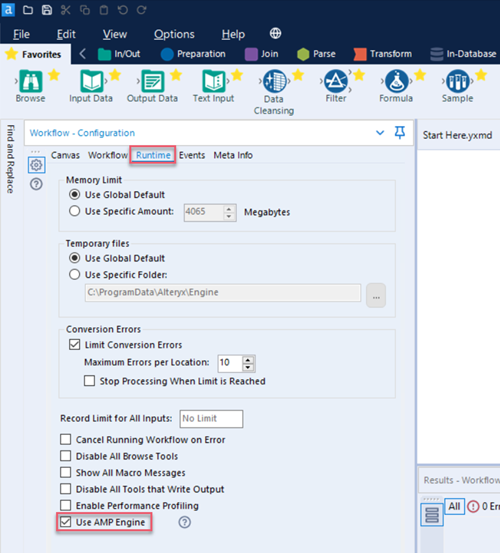

# FAQ 

## Where are the debug logs located?

Internal tool logs are written to a file called PythonSDK.log located in Local AppData. For example, `%LOCALAPPDATA%\Alteryx\Log\PythonSDK.log`. The logger object within a tool also writes to this file.

:information_source: `%LOCALAPPDATA%` usually stands for `C:\users\{username}\AppData\Local\`. For more information, refer to `FOLDERID_LocalAppData` [here](https://learn.microsoft.com/en-us/windows/win32/shell/knownfolderid).

## How to get DEBUG level logs?

Ensure you launch the plugin with the environment variable `AYX_SDK_VERBOSE=1`.
For example, one way to do this is in the Windows Environment dialog. Windows 10+ users, go to [How Do I Set System Environment Variables in Windows 10](https://superuser.com/questions/949560/how-do-i-set-system-environment-variables-in-windows-10_E) for more information.

## _"This tool is only supported in the AMP Engine"_

If you encounter this error (as shown below) _"This tool is only supported in the AMP Engine. Please enable AMP to use this tool."_:


 
Check that the AMP engine is enabled. In Designer's Workflow Configuration window, select the Runtime tab and ensure the Use AMP Engine check box is checked.


 
If you still encounter the error with the correct configuration, make sure the plugin was produced with version 2+ of the SDK.

:information_source: The version of Python SDK that the tool uses is located in `requirements-thirdparty.txt`.

```
ayx_python_sdk==2.1.2
```


## _"Internal error: Failed to read port assignment"_

When you encounter a "…Failed to read port assignment…" (below) error message, the cause is almost always a mismatch of versions. That is, you use a V1 plugin in Designer version 2021.4+ that requires a V2 plugin.


Another cause might be incorrect plugin code. You can diagnose the issue [here](#can-i-run-plugins-outside-of-designer).

## _"How can I update tool config?" Or, "update_tool_config is not saving"_

You can now call `save_tool_config()` to save configuration.

## _"How do I get incoming connection metadata?"_

You can get Metadata in one of two ways:

1. Via `self.provider.incoming_anchors["{ANCHOR_NAME}"][{CONNECTION_NAME}]['metadata']`.
2. Via `on_record_batch()`: Grab the [Arrow](https://arrow.apache.org/) schema from the record batch.
You can find any metadata available in `self.provider.incoming_anchors[anchor_name][connection_name]['metadata']`.

## _"How do I push outgoing anchor metadata?"_

Use `push_outgoing_metadata(connection_name, pyarrow_schema)` to push metadata updates downstream. Use `create_schema` in `ayx_python_sdk.core.utils` to create a schema.

## _"Why doesn’t metadata propagate downstream?"_

We do not require metadata definitions by default. If you need to propogate metadata, use
`push_outgoing_metadata` in the `init` method.

:information_source: Only the `init` method is called when the AMP engine runs in UPDATE mode. So be sure to do it there.

:information_source: We also allow metadata to be inferred for a given anchor from the first record batch sent. This doesn't work if metadata needs to be sent out in `UPDATE` mode.

## _"A converted tool (from a previous SDK version) runs slower than expected."_

We no longer require the use of Pandas and DataFrames for record IO. If your tools don't require Pandas for their functionality, use the provided pyarrow format and avoid unnecessary data conversion to drastically improve run times.

## _"Can I use Python’s multiprocessing and/or threads?"_

Yes, but only if you really need to. Before you do, please read our [Extensibility Best Practices](best_practices.md).

## _"Can I run Plugins outside of Designer?"_

Yes!
One way is to run directly with Python from the terminal. For example:
```cmd
C:\Users\Your.Name\AppData\Local\Alteryx\bin\Python\python-3.8.5-embed-amd64\python.exe main.pyz start-sdk-tool-service ayx_plugins Input
```

Recently, we released the [Test Client CLI](https://help.alteryx.com/developer-help/test-client).
```cmd
./ayx-sdk-cli.exe plugin run BaseTools::Passthrough --input input.csv --out output.csv
```

## _"My Plugin seems slow. How do I profile it?"_

[Pyinstrument](https://github.com/joerick/pyinstrument) is a great way to profile your code. Start the profiler in `__init__` and end the report in `on_complete()`.

## _"How can I utilize arbitrary assets in my tool?"_

To package arbitrary assets...

1. Create an assets directory under backend and place your files there.
2. Modify backend/setup.py for your tool. Add this to the setup section:

```
package_data={
    PACKAGE_NAME: [
        "assets/*",
    ]
} 
```
Then, access these assets in your tool. For example:
`assets_directory = Path(os.path.realpath(__file__)).parent / "assets"`

## _"How can I easily extend metadata?"_

Example: Add a Field to Existing Metadata:
```python
new_field = Field('MyField', FieldType.v_wstring, 1024, 0)
new_field = pa.field(my_field.name, pa.string(), metadata=new_field.as_arrow_metadata())

from ayx_python_sdk.core.utils import set_metadata
set_metadata(table, [...existing fields..., new_field])
```

## _"I want to mutate a field"_

As a first step, please check the documentation on Compute. [Arrow Compute](https://arrow.apache.org/docs/python/compute.html) can be very fast. 

Another handy method is via apply(). For example:
```python
def mutate_string(s: str) -> str:
  return f'Mutated {s}'

...
new_data = pa.array(batch.column('MyStringColumn').to_pandas().apply(mutate_string))
out_batch = pa.Table.from_arrays([new_data, batch.column('ColumnToKeepAsIs')], schema=batch.schema)
```

## _"We are facing issues with 70 days and 1 day getting appended to the date fields"_

Use the newest version of the Python SDK which contains fixes that concern date and time. Use the `arrow_scalar_date32_to_py` (`ayx_python_sdk.providers.amp_provider.utilities.conversions`) in case you use the tool in an older version of Designer.

Older versions of Designer process the date incorrectly. This function ensures dates are set correctly for those versions of Designer, otherwise the function simply does nothing.

## _"Why does the CLI use Python?"_

Since we were already developing a Python SDK, it made sense to use
Python for the CLI, too. Python lets us leverage the [doit automation
tool](https://pydoit.org/) to build the CLI. We chose to use
[Typer](https://typer.tiangolo.com/) in combination with doit because it lets us map CLI
commands to doit tasks.


## _"Can I use the CLI and SDK behind a firewall?"_

### _"Do I need to whitelist anything to use the CLI?"_

To download and install the CLI, receive notifications of newer versions of the
CLI, or check for updates to the CLI, you need to whitelist
https://pypi.org/.
Otherwise, feel free to use the CLI completely offline.

### _"What packages do I need to download?"_

All of the required Python packages that you need to get started with
development are downloaded and installed when you install the CLI and
SDK (as part of their dependencies).

The requirements for each package are:

-   **SDK**: \"Click==7.1.2\", \"grpcio==1.39.0\", \"numpy\>=1.17.1\",
    \"deprecation==2.1.0\", \"pyarrow==5.0.0\", \"pandas==1.1.0\",
    \"protobuf\>=3.5.0.post1\", \"psutil==5.6.3\", \"pydantic==1.8.2\",
    \"python-dateutil==2.8.1\", \"pytz==2020.1\", \"shiv==0.3.1\",
    \"six==1.14.0\", \"typer==0.3.1\", \"xmltodict==0.12.0\",
    \"requests==2.24.0\", PyPAC==0.15.0\"
-   **CLI**: \"typer==0.3.1\", \"doit==0.33.1\", \"pydantic==1.8.2\",
    \"packaging==20.4\", \"requests==2.24.0\", \"xmltodict==0.12.0\"


## _"Why another Python SDK?"_

The original [Python Engine
SDK](https://help.alteryx.com/developer-help/python-engine-sdk) is complex, runs in-process, and can be slow. The [AYX
Python SDK](https://help.alteryx.com/developer-help/ayx-python-sdk) design solves these issues. It runs
out-of-process using gRPC to communicate. It also simplifies the
development process of new tools to 4 function calls, abstracting away a
lot of the previous SDK function calls.

By running the plugin out-of-process, we are able to efficiently manage
multiple plugins and are not bound by the restrictions of the C++
`boost` library.


## _"Python Engine SDK and AYX Python SDK. What's the difference?"_

[AYX Python SDK](https://help.alteryx.com/developer-help/ayx-python-sdk-v2) is a new SDK product. It improves upon
the original Python Engine SDK by providing a consistent development
experience moving forward. While the Python Engine SDK was designed to
use the original engine, the new AYX Python SDK leverages the brand new [AMP
Engine](https://help.alteryx.com/20223/designer/alteryx-amp-engine).


## _"Are there any changes to packaging between the Python Engine SDK and AYX Python SDK?"_

In the new SDK, we switched from using packaged up virtual environments
to python zip apps. We believe this update provides an overall positive
change because now tools with different environments work on the same
tool canvas (no virtual environment collisions).

Please note that this might change how you packaged up, distributed, and
tested your plugins.


## _"Do I need Alteryx Designer to build and test a plugin?"_

Alteryx Designer is not required to build a custom plugin. However,
Designer is required to test a plugin and make sure that it works
correctly.


## _"What IDE should I use?"_

We recommend [Visual Studio Code](https://code.visualstudio.com/) or [PyCharm](https://www.jetbrains.com/pycharm/).


## _"What's the purpose of the AYX Plugin CLI?"_

The AYX Plugin CLI provides a single mechanism to guide you through the
entire SDK development process, from scaffolding to packaging. It lets
you create tools quickly, familiarize yourself with the SDKs, and it
reduces the potential for error.

The CLI facilitates the process of custom tool creation for any SDK.
*Note that at this time it only supports Python.*\


## _"What's the difference between sdk-workspace-init and create-ayx-plugin commands?"_

-   `sdk-workspace-init`: This command initializes a workspace directory
	--- think of this as a project playground where all your custom
	plugins exist. The workspace directory is set up with a
	pre-defined folder structure, which enables the rest of the CLI
commands to properly function.
-   `create-ayx-plugin`: This command adds a plugin to the workspace.
    You must choose a template tool type and specify a tool name.


## _"I see a \"Can\'t find plugin SdkEnginePlugin.dll\" error message, what do I do?"_

If you encounter the \"Can't find plugin SdkEnginePlugin.dll\" error,
[enable the AMP Engine
runtime](https://help.alteryx.com/node/9521#how-to-switch-on-amp)
in Alteryx Designer. To do so\...

1.  In Alteryx Designer, access the **Workflow - Configuration** window.
2.  Select the **Runtime** tab.
3.  Check the check box to **Use AMP Engine**.\



## _"How do I customize the icon for a new Alteryx tool category?"_

This is not done directly via the SDK, however, you can customize the
icon via these instructions:

1.  Find an icon you would like to use for the tool category. The icon
    must be in PNG format.
2.  Rename the icon file to match the tool category name
    *exactly.* Remove any spaces and punctuation from the file name. For
    example, \"New Tools\" becomes \"NewTools\".
3.  Place the file in the folder that contains the Alteryx icons:
    **C:\\Program Files\\Alteryx\\bin\\RuntimeData\\icons\\categories**.
4.  Restart Designer.


## _"I use SDK version 2.0.0 and see an \"InboundPipeError\" message. What do I do?"_

You might receive this error if you have an incorrect version of the
protobuf library in the setup for your AYX Python plugin. To address the
error\...

1.  Please go to the directory that contains the
    **ayx_workspace.json** file for your Python SDK plugin.
2.  Next, go to the \\backend sub-folder and add this line to the
    **requirements-thirdparty.txt** file: `protobuf==3.20.1`.
3.  Rebuild the plugin.
