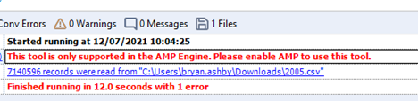
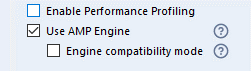
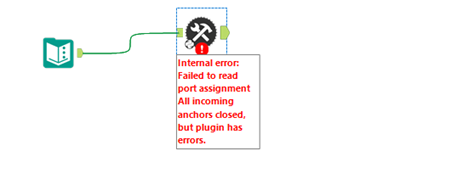

# FAQ 

## Where are the debug logs located?

Internal tool logs are written to a file called PythonSDK.log located in Local AppData. For example, `%LOCALAPPDATA%\Alteryx\Log\PythonSDK.log`. The logger object within a tool also writes to this file.

:information_source: `%LOCALAPPDATA%` usually stands for `C:\users\{username}\AppData\Local\`. For more information, refer to `FOLDERID_LocalAppData` [here](https://learn.microsoft.com/en-us/windows/win32/shell/knownfolderid).

## How to get DEBUG level logs?

Ensure you launch the plugin with the environment variable `AYX_SDK_VERBOSE=1`.
For example, one way to do this is in the Windows Environment dialog. Windows 10+ users, go to [How Do I Set System Environment Variables in Windows 10](https://superuser.com/questions/949560/how-do-i-set-system-environment-variables-in-windows-10_E) for more information.

## _"This tool is only supported in the AMP Engine"_

If you encounter this error (as shown below) _"This tool is only supported in the AMP Engine. Please enable AMP to use this tool."_:


 
Check that the AMP engine is enabled. In Designer's Workflow Configuration window, select the Runtime tab and ensure the Use AMP Engine check box is checked.


 
If you still encounter the error with the correct configuration, make sure the plugin was produced with version 2+ of the SDK.

:information_source: The version of Python SDK that the tool uses is located in `requirements-thirdparty.txt`.

```
ayx_python_sdk==2.1.2
```


## _"Internal error: Failed to read port assignment"_

When you encounter a "…Failed to read port assignment…" (below) error message, the cause is almost always a mismatch of versions. That is, you use a V1 plugin in Designer version 2021.4+ that requires a V2 plugin.



Another cause might be incorrect plugin code. You can diagnose the issue [here](#can-i-run-plugins-outside-of-designer).

## _"How can I update tool config?" Or, "update_tool_config is not saving"_

You can now call `save_tool_config()` to save configuration.

## _"How do I get incoming connection metadata?"_

You can get Metadata in one of two ways:

1. Via `self.provider.incoming_anchors["{ANCHOR_NAME}"][{CONNECTION_NAME}]['metadata']`.
2. Via `on_record_batch()`: Grab the [Arrow](https://arrow.apache.org/) schema from the record batch.
You can find any metadata available in `self.provider.incoming_anchors[anchor_name][connection_name]['metadata']`.

## _"How do I push outgoing anchor metadata?"_

Use `push_outgoing_metadata(connection_name, pyarrow_schema)` to push metadata updates downstream. Use `create_schema` in `ayx_python_sdk.core.utils` to create a schema.

## _"Why doesn’t metadata propagate downstream?"_

We do not require metadata definitions by default. If you need to propogate metadata, use
`push_outgoing_metadata` in the `init` method.

:information_source: Only the `init` method is called when the AMP engine runs in UPDATE mode. So be sure to do it there.

:information_source: We also allow metadata to be inferred for a given anchor from the first record batch sent. This doesn't work if metadata needs to be sent out in `UPDATE` mode.

## _"A converted tool (from a previous SDK version) runs slower than expected."_

We no longer require the use of Pandas and DataFrames for record IO. If your tools don't require Pandas for their functionality, use the provided pyarrow format and avoid unnecessary data conversion to drastically improve run times.

## _"Can I use Python’s multiprocessing and/or threads?"_

Yes, but only if you really need to. Before you do, please read our [Extensibility Best Practices](best_practices.md).

## _"Can I run Plugins outside of Designer?"_

Yes!
One way is to run directly with Python from the terminal. For example:
```cmd
C:\Users\Your.Name\AppData\Local\Alteryx\bin\Python\python-3.8.5-embed-amd64\python.exe main.pyz start-sdk-tool-service ayx_plugins Input
```

Recently, we released the [Test Client CLI](https://help.alteryx.com/developer-help/test-client).
```cmd
./ayx-sdk-cli.exe plugin run BaseTools::Passthrough --input input.csv --out output.csv
```

## _"My Plugin seems slow. How do I profile it?"_

[Pyinstrument](https://github.com/joerick/pyinstrument) is a great way to profile your code. Start the profiler in `__init__` and end the report in `on_complete()`.

## _"How can I utilize arbitrary assets in my tool?"_

To package arbitrary assets...

1. Create an assets directory under backend and place your files there.
2. Modify backend/setup.py for your tool. Add this to the setup section:

```
package_data={
    PACKAGE_NAME: [
        "assets/*",
    ]
} 
```
Then, access these assets in your tool. For example:
`assets_directory = Path(os.path.realpath(__file__)).parent / "assets"`

## _"How can I easily extend metadata?"_

Example: Add a Field to Existing Metadata:
```python
new_field = Field('MyField', FieldType.v_wstring, 1024, 0)
new_field = pa.field(my_field.name, pa.string(), metadata=new_field.as_arrow_metadata())

from ayx_python_sdk.core.utils import set_metadata
set_metadata(table, [...existing fields..., new_field])
```

## _"I want to mutate a field"_

As a first step, please check the documentation on Compute. [Arrow Compute](https://arrow.apache.org/docs/python/compute.html) can be very fast. 

Another handy method is via apply(). For example:
```python
def mutate_string(s: str) -> str:
  return f'Mutated {s}'

...
new_data = pa.array(batch.column('MyStringColumn').to_pandas().apply(mutate_string))
out_batch = pa.Table.from_arrays([new_data, batch.column('ColumnToKeepAsIs')], schema=batch.schema)
```

## _"We are facing issues with 70 days and 1 day getting appended to the date fields"_

Use the newest version of the Python SDK which contains fixes that concern date and time. Use the `arrow_scalar_date32_to_py` (`ayx_python_sdk.providers.amp_provider.utilities.conversions`) in case you use the tool in an older version of Designer.

Older versions of Designer process the date incorrectly. This function ensures dates are set correctly for those versions of Designer, otherwise the function simply does nothing.
