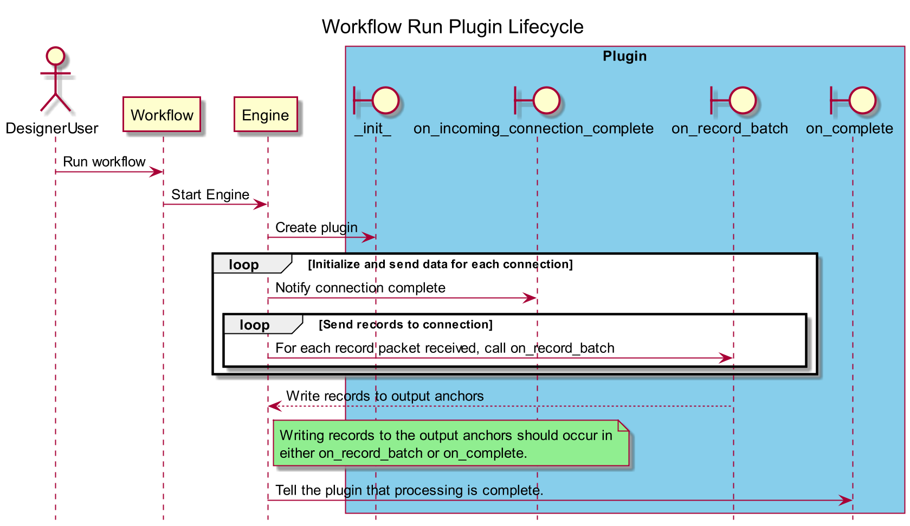
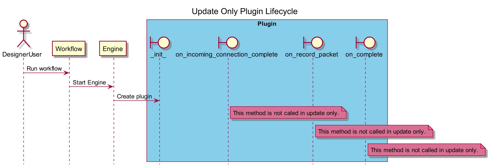

Lifecycle of a Plugin
=====================

Prerequisites
-------------

This overview refers to Plugins, in reference to any new `PluginV2`
class developed with the SDK.

Overview
--------

The lifecycle of a `Plugin` in Alteryx Designer can be broken down into
2 different types of runs:

1.  Workflow Run
2.  Update Only Run

Workflow Run
------------

When you select the **Run** button in Designer, an instance of your
`PluginV2` class is created for each of your tools on the canvas.

The `PluginV2` is constructed via its `__init__` method, just like in
normal Python. An instance of a `ProviderV2` class is given to the
plugin. Any resources required to read from and write to Designer can be
obtained via methods/properties on the `ProviderV2`.

In Alteryx Designer, input anchors can have 1 or many connections. If
you have any input connections, the next stage of the lifecycle
consists of each of those input connections sending data downstream. From
the `PluginV2` perspective, the `on_incoming_connection_complete` method
is called for each connection once the engine is done sending records.
The parameter that `on_record_batch` receives is the connection that a
new record packet is available on.

Once all record batches for all connections are received, the Plugin\'s
`on_complete` method is called in order to do any cleanup.

If your `PluginV2` class does not have any input anchors, the lifecycle
is the same, however, `on_incoming_connection_complete`, and
`on_record_batch` never get called, since there are no
connections/received records. This means that any records that you wish
to output must be written to the output anchor during the `on_complete`
method (you shouldn\'t write them during `__init__`, for reasons
described below).

In order to write records to your Plugin\'s output anchors, they must
first be `open`ed with metadata. This `Metadata` object describes the
record schema for that output anchor (for example, field names, types,
etc.).

Refer to this sequence diagram for a visual representation of this
lifecycle:

Update Only Run
---------------

Update only is a mode that runs in Designer any time\...

1.  A new tool is added to the canvas.
2.  Any tool on the canvas has a change in configuration (typically, via
    the user interface or Configuration panel).

The purpose of this run mode is to generate the metadata that each tool
will output during the next time a workflow runs. This allows new tools
on the canvas to know what columns they can operate on. The metadata
that comes out of a tool typically depends on\...

1.  The incoming metadata.
2.  The configuration of the tool (via the user interface).

In this mode, only the `__init__` method is called.

Since the goal of an update-only run is to build output metadata, the
`__init__` method is run. This method has an instance of the
`AMPProviderV2`, which sets incoming and outgoing anchor information,
including the name and metadata. Additionally, since `__init__` runs in
update-only mode, you should aim to perform a minimal amount of
processing in this method, since a fast update makes users happy.

Refer to the sequence diagram for a visual representation of this
lifecycle:

